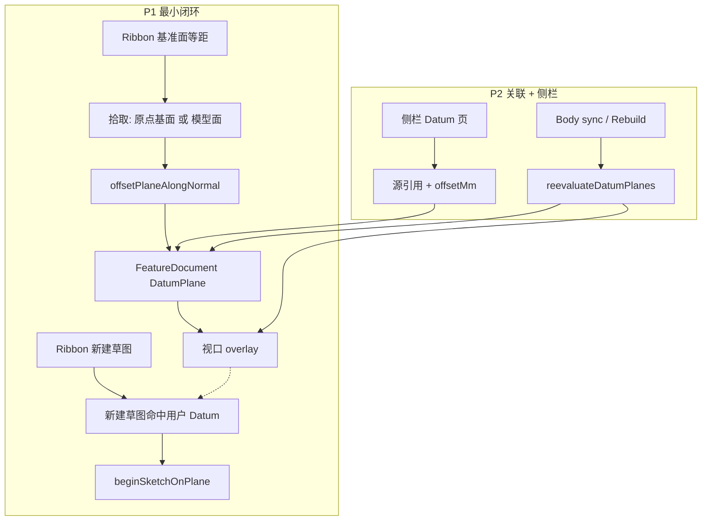
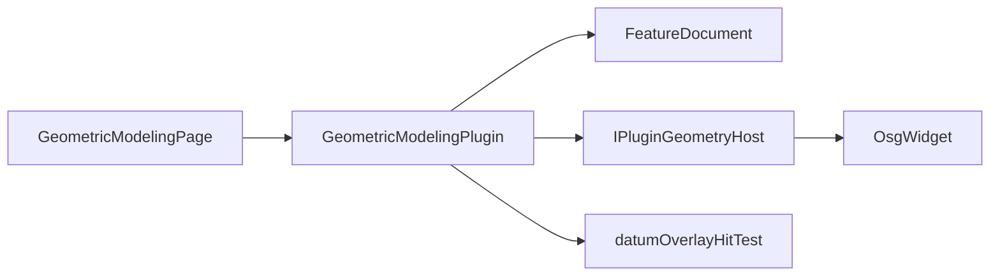
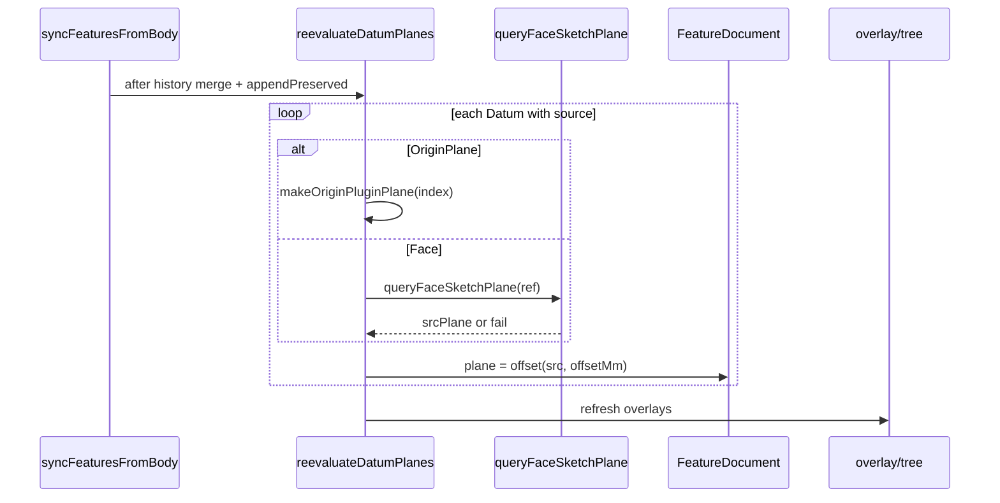

# DESIGN — 参考面（C + D）

## 整体架构



## 分层

| 层 | P1 | P2 |
|----|----|----|
| Plugin | 等距源扩展；新建草图 Datum 命中；overlay 射线 | 侧栏；源字段读写；reevaluate |
| FeatureDocument | 可仍只存烘焙 plane | + datumSource* / datumOffsetMm 持久化 |
| Host / OsgWidget | 尽量不改；必要时 `pickUserPlanes` | 仅当插件无法可靠命中 overlay 时 bump |
| GeometryAlgorithm | 不改 | 不改（重算仍用 queryFaceSketchPlane + 偏移） |

## 模块依赖



## 接口契约

### P1 — 新建草图命中 Datum（推荐插件内）

```text
// 在 pickOriginSketchPlane 会话期间，插件或 Host 增加并行命中：
hitUserDatum(screenX, screenY, datums[]) → optional PluginSketchPlane
优先级建议：用户 Datum ≈ 原点平面（按深度），再模型面；或 Datum 优先于模型面以免被遮挡
```

若插件拿不到指针坐标：扩展 Host ABI（需版本 bump）：

```text
pickOriginSketchPlaneEx(doc, extraPlanes[], onFinished)
```

### P1 — 等距源

```text
Offset 流程：
  1) 并行拾取 OriginPlane(0..2) | Face
  2) 得到 PluginSketchPlane src
  3) dist = QInputDialog / 侧栏（P1 可仍用对话框）
  4) plane = offsetAlongNormal(src, dist)
  5) addDatumPlane(plane)  // P2 起同时写入 source + offset
```

### P2 — 数据

```text
GeomodelingFeature +=
  enum DatumSourceKind { None, OriginPlane, Face }
  datumSourceKind
  datumOriginPlaneIndex   // OriginPlane
  datumFaceBackendId      // Face
  datumFaceIndex
  datumOffsetMm
  // DatumPlaneAngle 保持 datumAngleDeg + hinge；可选 datumFace* 作关联源
```

### P2 — 侧栏

```text
showDatumPanel(featureId)
  - offset spin / angle spin
  - 按钮：重选源
  - Apply → 写回 FD + reevaluate + refresh overlay
  - 「在此面开草图」→ beginSketchOnPlane
双击 Datum → showDatumPanel（不再直接开草图）
```

## 数据流（关联重算）



## 异常策略

| 情况 | 行为 |
|------|------|
| 非平面面 | 警告，不结束拾取会话（与现网一致） |
| Face 索引失效 | 保留烘焙 plane，hostLogWarn |
| 共线三点 | 拒绝创建（现网） |
| Overlay 未命中 | 继续原点/模型面拾取 |

## 风险

| 风险 | 缓解 |
|------|------|
| Datum overlay 无深度缓冲难命中 | 用已知四边形与相机射线求交；半尺寸与绘制一致（现 ~40mm） |
| 双击行为变更打扰用户 | P2 侧栏含「开草图」；文档说明 |
| 草图不跟随造成「面动了草图留在旧位置」 | 见 CONSENSUS 未决 D-S0/D-S1 |
