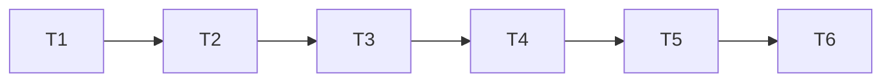

# TASK — 参考面（C + D + D-S1）

## 已确认

- 范围：C-A + C-B + D（关联/侧栏）+ **D-S1**（Sketch.`datumPlaneId` 跟随）
- 交付：P1 → P2；Debug|x64 + Release|x64

## 任务列表

### T1 文档锁定 D-S1
- 更新 CONSENSUS/DESIGN/ALIGNMENT
- 验收：未决项关闭

### T2 FeatureDocument 字段与 JSON
- `DatumSourceKind`、源 Face/Origin、`datumOffsetMm`
- Sketch.`datumPlaneId`
- `addDatumPlane` / `addSketch` 写入源与引用
- 验收：toJson/fromJson 往返

### T3 Host ABI 1.49.0 — `pickSketchSupportPlane`
- 原点 + 模型面 + extra 用户面并行拾取；回调带 tag
- OsgWidget 扩展 hit extra（半尺寸与 overlay 一致 40mm）
- 验收：插件可点选 Datum 与基面

### T4 P1 插件接线
- `onDatumPlane` 等距：用 support pick（基面|面）+ 偏移 + 写源字段
- `onNewSketch`：extras=用户 Datum；命中 tag → `beginSketchOnPlane(..., datumId)`
- 验收：ALIGNMENT P1 #1–#4

### T5 P2 侧栏 + reevaluate + 草图跟随
- `m_pageDatum`：偏移、Apply、开草图、重选源
- 双击 Datum → 侧栏
- `reevaluateDatumPlanes` + 更新挂接草图 plane/profile + rebuildDownstream
- 验收：CONSENSUS P2 #6–#9 + D-S1

### T6 编译
- GeometricModelingPlugin + CloudSimHost（若改 Host）Debug/Release x64

## 依赖

