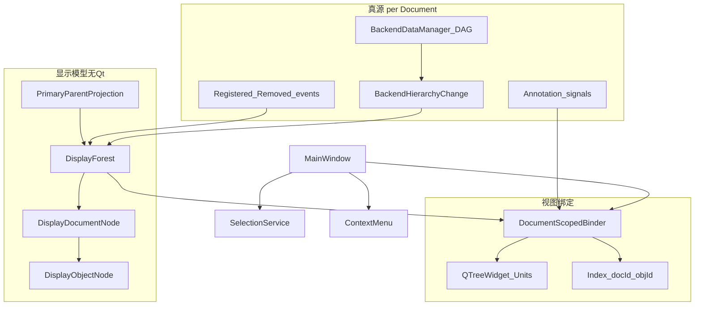
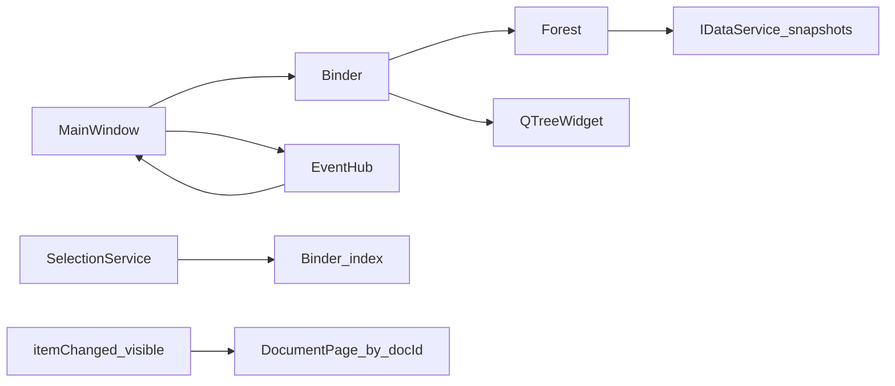
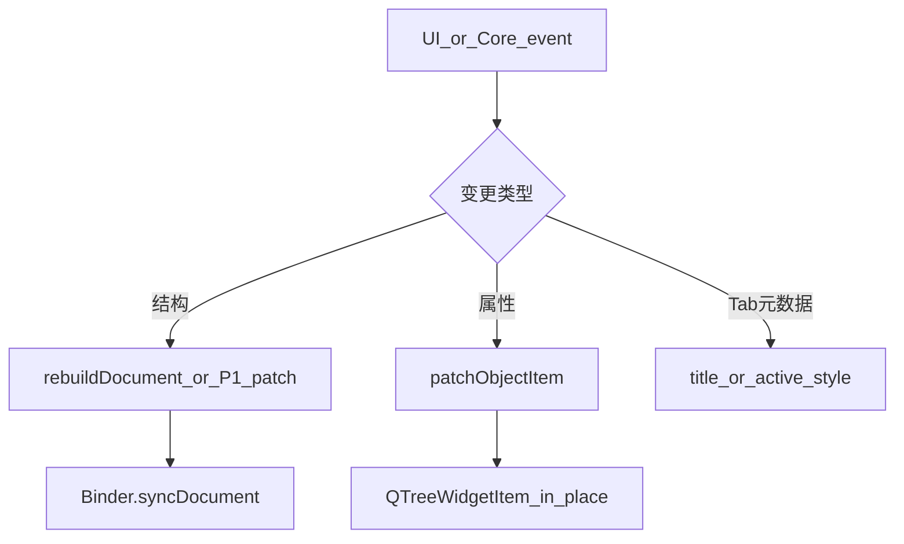

# DESIGN：后端对象显示树

> 依据：[CONSENSUS](CONSENSUS_后端对象显示树.md)、[ALIGNMENT](ALIGNMENT_后端对象显示树.md)

## 1. 整体架构



## 2. 分层与核心组件

| 层 | 组件 | 职责 | 非职责 |
|----|------|------|--------|
| 投影 | `PrimaryParentProjection` | `parentIds` 空 → 文档虚拟父；否则 `front()`；保证 1 对象 1 节点 | 不写 Data 边 |
| 模型 | `DisplayForest` | 打开文档 → 文档节点森林；`rebuildDocument(docId)` /（P1）`applyHierarchyEvent` | 不碰 Qt |
| 绑定 | `DocumentScopedBinder` | 将单文档子树同步到对应 top-level item；维护索引；`patchObjectItem` | 不扫其它文档 |
| 编排 | `MainWindow` | 订阅事件、Tab 生命周期、选中/菜单/`activateDocumentForItem` | 不再内联拼树算法 |

建议落点（实现阶段）：

- `Widget/inc|source/BackendUnitsDisplayForest.*`（纯结构 + 投影）
- `Widget/inc|source/BackendUnitsTreeBinder.*`（QTreeWidget 绑定）
- `MainWindow_p.h` 扩展 itemType / role
- 瘦身 `MainWindowBackendTree.cpp` 为路由

Core 不引入 Qt；无需新契约类型（P2 可选 `DisplayTreeDto`）。

## 3. 模块依赖



## 4. 数据模型（显示侧）

```text
DisplayForest
  documents: ordered list of DisplayDocumentNode
DisplayDocumentNode
  documentId, title, isActive
  annotations: list of { id, displayText, visible }
  objects: map id → DisplayObjectNode
  roots: object ids with no primary parent (or parent missing)
DisplayObjectNode
  id, name, className, visible, primaryParentId?, childIds[]
```

构建输入：`IDataService::listObjectSnapshots()` + Tab 标题 + `IRenderView::annotationSnapshots()`（按文档）。

## 5. 接口契约（实现阶段）

| API | 说明 |
|-----|------|
| `Forest::ensureDocument(docId, title)` | Tab 打开 |
| `Forest::removeDocument(docId)` | Tab 关闭 |
| `Forest::setActiveDocument(docId)` | 切 Tab（仅标记） |
| `Forest::rebuildDocument(docId, snapshots, anns)` | P0 结构真源同步 |
| `Forest::patchObjectVisible/Name(...)` | 属性 |
| `Binder::syncDocument(docId)` | 重建该文档 top-level 子树（不动其它根） |
| `Binder::patchObjectItem(...)` | 勾选/文案 |
| `Binder::findItem(docId, backendId)` | 索引查询 |
| `MainWindow::activateDocumentForItem(item)` | 切 Tab + active scope |

### ItemDataRole（扩展 `MainWindow_p.h`）

| 常量 | 用途 |
|------|------|
| `kItemTypeDocument` | 文档根 |
| `kItemTypeAnnotationGroup` | Annotations 分组 |
| `kItemTypeBackend` / `kItemTypeAnnotation` | 已有 |
| `kRoleDocumentId` | 所有文档作用域节点 |
| `kRoleBackendId` / `kRoleAnnotationId` | 已有 |

移除全局唯一 `m_backendRootItem` / 单一 `m_annotationRootItem`；改为映射表。

## 6. 数据流与更新分类

| 事件 | 路径 | 复杂度 |
|------|------|--------|
| Tab 打开 | ensureDocument → rebuildDocument → syncDocument | O(该文档对象) |
| Tab 关闭 | removeDocument → 移除 top-level + 清索引 | O(该文档节点) |
| Tab 切换 / 改名 | setActive + 标题/字体 patch | O(1) |
| Object Registered/Removed | P0：rebuildDocument(docId)；P1：局部增删 | P0 O(文档) |
| Edge attach/detach | P0：rebuildDocument；P1：reparent | 同上 |
| visible / name | patchObjectItem | O(1) |
| Annotation CRUD | 增量改该文档 annotation 分组 | O(1) |
| suppress 结束 | rebuildDocument(受影响文档) | O(该文档) |

**禁止**：`m_backendTree->clear()` 或根上对**全部**文档 `takeChildren` 后重扫所有页。

## 7. 结构 / 属性分流



可见性真源仍为 `BackendDataBase::m_visible`（见 backend_visibility）；树勾选为派生视图，写回须带 `documentId` 解析到正确 `DocumentPage`。

## 8. 联动设计（同步优化）

| 面 | 设计 |
|----|------|
| Selection | 读 item 的 `documentId`；非活动则 `activateDocumentForItem`；再更新属性面板 / OSG selection |
| Visibility | `itemChanged` → 按 `documentId` 找 page → `data().setVisible` + OSG；子树级联用该页 `hierarchyModel` |
| ContextMenu | 按 item 解析 page / `IRenderView`；分组用 `kItemTypeAnnotationGroup`，禁止指针相等全局根 |
| Annotation 信号 | `sender` → page → `annotationGroupByDoc[docId]` 增量增删改 |
| focus | 默认活动文档索引；找不到可全局按 backendId 回退一次 |
| OSG 调试树 | 仍 `currentPage` only；与 Units refresh 解耦（切 Tab 可只刷 OSG 树） |

影响矩阵全文见 [ALIGNMENT §6](ALIGNMENT_后端对象显示树.md)。

## 9. 异常与边界

| 情况 | 处理 |
|------|------|
| 主父 id 不在快照中 | 对象挂文档根（防御） |
| 多父 | 仅主父；次父不显示 |
| suppress 中事件 | 忽略逐条刷新；结束一次 rebuild |
| 空文档 | 仍显示文档根 + 空 Annotations 分组 |
| 跨文档同 backendId（异常） | 索引键含 documentId，互不覆盖 |

## 10. 与 OSG 场景树关系

| 树 | 范围 | 更新 |
|----|------|------|
| Units | 全部打开文档的显示投影 | 文档作用域 |
| OSG Scene | 仅活动文档渲染图调试 | 切 Tab / 场景变更时刷新 |

二者不得合并为同一控件。
