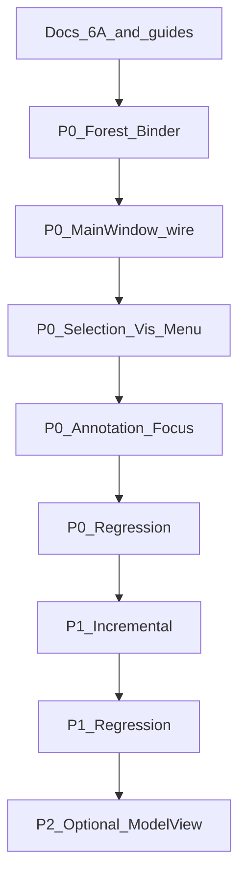

# TASK：后端对象显示树

> 依据：[DESIGN](DESIGN_后端对象显示树.md)、[CONSENSUS](CONSENSUS_后端对象显示树.md)  
> **代码实现须本包文档审批通过后启动。** 本文档阶段交付：本文件 + ALIGNMENT/CONSENSUS/DESIGN + 指南同步。

## 依赖图

---

## D0 — 方案文档与指南（本期）

| 项 | 内容 |
|----|------|
| 输入 | 计划共识 C+B、效率框架 |
| 输出 | ALIGNMENT / CONSENSUS / DESIGN / TASK；Core/Data/Widget DEVELOPER_GUIDE；backend_visibility 交叉引用 |
| 验收 | 四文档齐全；指南含显示树投影与效率原则；明确「审批后编码」 |
| 状态 | **已完成**（2026-07-23） |

---

## P0 — 语义正确 + 基线效率

**状态：已实现（2026-07-23）**

| 任务 | 落点 |
|------|------|
| P0-T1 Forest | `BackendUnitsDisplayForest.h/.cpp` |
| P0-T2 Binder | `BackendUnitsTreeBinder.h/.cpp` |
| P0-T3 接线 | `MainWindowBackendTree` / UiSetup / Tab / 事件 |
| P0-T4 Selection/Vis/Menu | `MainWindowSelectionService` + ContextMenu |
| P0-T5 Annotation/focus | 按 documentId 增量；`focusBackendInTreeLocal` |
| P0-T6 回归 | 见 ACCEPTANCE 手动清单 |

## P1 — 增量高效

### P1-T1 Hierarchy / 局部结构补丁

| 项 | 内容 |
|----|------|
| 输入 | `BackendHierarchyChange` 或等价 Core 事件 |
| 输出 | insert / remove / reparent；保留展开状态（按 id） |
| 验收 | 单对象注册不重建整文档树（或可测的局部路径）；可见性/改名零结构重建（强制） |

### P1-T2 属性补丁硬化

| 项 | 内容 |
|----|------|
| 输出 | name/visible 仅 `patchObjectItem`；无 rebuild 调用 |
| 验收 | CONSENSUS 效率项 7 强制通过 |

---

## P2 — 可选

- `QAbstractItemModel` + `QTreeView` 替换 Units 控件  
- 或 Core 增加无 Qt 的 `DisplayTreeDto` 供多前端复用  

非本阶段必做。

---

## 并行说明

- D0 与编码互斥：D0 完成并审批前不合并 P0 代码  
- P0-T4 / P0-T5 可在 P0-T3 之后并行  
- P1 依赖 P0 回归通过  

## 实现约束（编码时）

- 遵循现有 Widget 风格与中文注释规范  
- 不改 Data 多父存储与工程 JSON  
- 不合并 OSG 场景树进 Units  
