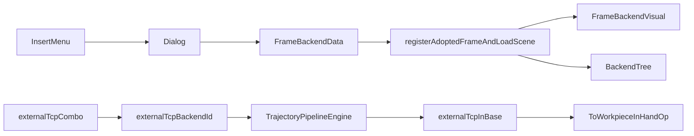

# DESIGN：坐标系后端对象

## 分层

| 层 | 组件 |
|----|------|
| Data | `FrameBackendData` + Registry builtins |
| Visual | `FrameBackendVisual` + Registry |
| Host | `BackendProjectObjectIo` 加载分支、`registerAdoptedFrameAndLoadScene` |
| Widget | Insert 菜单、`onCreateCoordinateFrame` |
| RobotWidget | 外部 TCP 下拉、Session 注入 resolver |
| RobotScene | Engine `setExternalTcpFrameResolver` + 逐步解析 |
| Builtins | `processPath` 优先 `ctx.externalTcpInBase` |

## 工程持久化

- 保存：`saveDerivedJson` 写 `geometry.kind=frame` + `axisLengthMm`（无文件 sidecar）
- 加载：`loadProjectObjectsFromJson` 识别 `FrameBackendData` / `CoordinateFrame`，即使无 `sourcePath` 也走 `registerEmbeddedProjectObject`（兼容旧工程仅有 pose、无 `geometry` 的条目）

## 接口

- `TrajectoryPipelineEngine::ExternalTcpFrameResolveFn(backendId, out, errMsg)`
- 参数键：`toWorkpiece.externalTcpBackendId`（空=手动）
