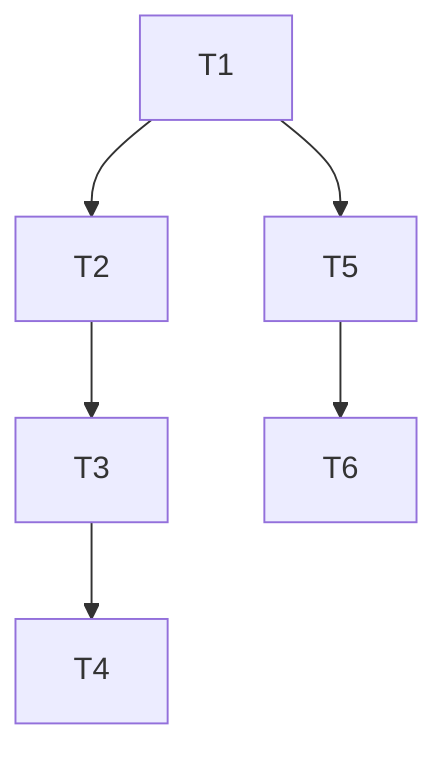

# TASK：坐标系后端对象

## T1 FrameBackendData
- 输入：无
- 输出：`FrameBackendData.h/.cpp`、Registry、Data.vcxproj
- 验收：className=`FrameBackendData`，有 pose/rotation 属性

## T2 FrameBackendVisual
- 依赖：T1
- 输出：Visual + Registry + vcxproj
- 验收：轴挂在 outer MT

## T3 Host IO/注册
- 依赖：T1/T2
- 输出：`registerEmbeddedProjectObject` 分支、`registerAdoptedFrameAndLoadScene`
- 验收：工程重开可加载 Frame

## T4 插入菜单
- 依赖：T3
- 输出：Insert 菜单、对话框、DEVELOPER_GUIDE
- 验收：可创建并聚焦树节点

## T5 外部 TCP 下拉
- 依赖：T1
- 输出：params/JSON/Op/Panel/EditPage
- 验收：选手动显示六数；选 Frame 隐藏六数

## T6 运行时
- 依赖：T5
- 输出：Context、Engine resolver、Session、processPath
- 验收：选 Frame 后预览/应用使用该世界位姿

