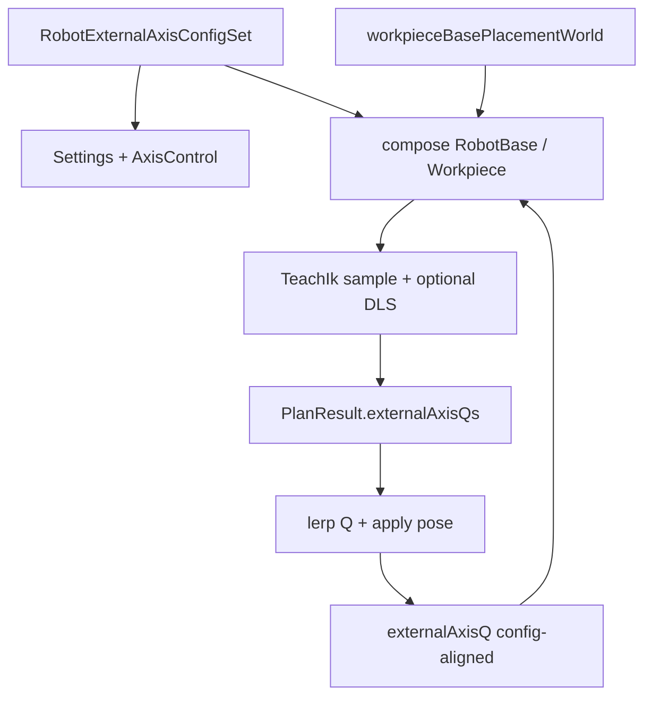
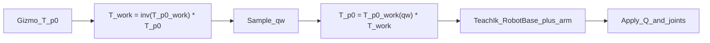

# DESIGN — 外部轴类型拓宽

## 架构

## 数据流
1. 配置变更 → 校验 Workpiece backend → 重置 Q 为 home
2. 轴控/播放 → full Q → FK 机器人 + 工件根矩阵
3. 规划 → 采样外轴 → 写 CSV/Qs → Run 按进度 lerp

## 二期 REP（Workpiece 工作架）

- `workingFrameId` 空 → 绑定根；非空 → W0 局部 Offset（`ensureWorkpieceWorkingFrameOffset`）
- 规划：`InstructionController` 外层工件采样 + 内层 RobotBase；需 `WorkpieceIkFrameContext`
- 拖动：`MainWindowRobotHost::solveTcpDragTeachIk` 同构

## 异常
- Workpiece 未绑 backend：配置校验失败并提示
- 旧工程仅标量 QMm：读兼容并展开到首个 RobotBase 轴
- 无 WorkpieceIkFrameContext：跳过工件采样（仅 RobotBase，可测路径）
