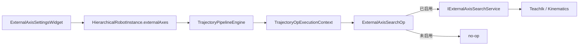
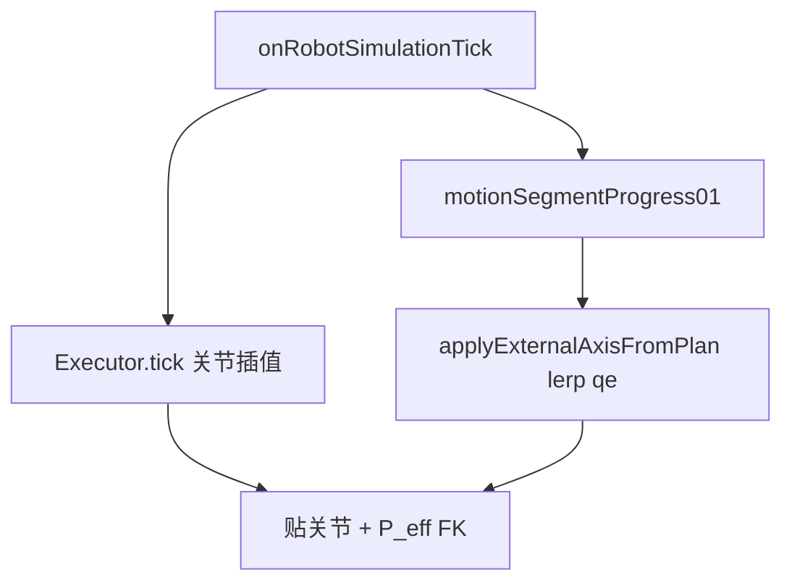

# DESIGN：外部轴联动求解

## 整体架构



## 数据模型

```text
RobotExternalAxisKind: LinearRail | Turntable
RobotExternalAxisConfig:
  enabled, displayName, jointName, kind, isPrismatic
  lower, upper, home
  axis[3]  // 基座系单位方向，默认 (1,0,0)
RobotExternalAxisConfigSet:
  axes[]
```

门禁：`any(axis.enabled)` 且列表非空。

## 运动学（地轨）

基座沿 `axis` 平移 `q_e`（mm）时，原基座系目标点变为：

`p'(q_e) = p - q_e * axis`

Level1：对 `q_e ∈ [lower,upper]` 网格搜索，固定 `q_e` 后对 `p'` 做臂 IK，按可达→残差→`|Δq_e|` 选优。

Level2：变量 `[q_arm; q_e]`，棱柱列步长按 mm 限幅；以 Level1 为 seed。

## 接口

- `write/readExternalAxisConfigSetToJson`
- `TrajectoryOpExecutionContext.externalAxisConfigs` + `externalAxisSearch`
- `TrajectoryPipelineEngine::setExternalAxisSearchService`
- `solveTeachIk` 扩展可选 `externalAxisEnabled/externalAxisMm/axis/limits`

## 异常

- 无配置：Search 成功返回，不改 traj
- 有配置无服务：跳过并可选 warning（不失败整条管道）
- 全网格不可达：写最优尝试的 snapshot，点 `reachable=false`

## 存储与运行时基座（P0 / P_eff）

```text
文档 / 工程：basePlacementWorld = P0（不含轨位）
运行态：     externalAxisQMm = q_e
FK / 显示：  P_eff = P0 * Trans(q_e · axis)
```

注意：项目 `Mat4` / OSG dump 平移分量在索引 **`[3,7,11]`**（与 `BackendMat4::translate` 一致），**不是** Eigen/OpenGL 的 `[12..14]`。写错会导致网格非刚性拉伸。

## Run 播放（臂 + 外轴）



| 规则 | 说明 |
|------|------|
| 轨迹 | `jointTrajectoryRad.size() >= 2` 时 Executor 优先插帧；**禁止**为省缓存清空播放用轨迹 |
| 外轴 | 段切换记录 `segmentStartQMm`；`qe = start + (target-start)*progress` |
| 时长 | `durationSec = max(关节梯形, 地轨梯形≈250mm/s)` |
| 预览 | `applyExternalAxisFromPlan` 默认 `progress01=1`（瞬间到位，不插帧） |
