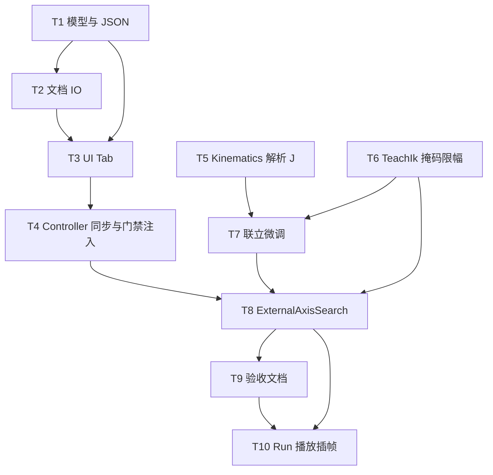

# TASK：外部轴联动求解

## 任务依赖

| ID | 内容 | 验收 |
|----|------|------|
| T1 | `RobotExternalAxes.*` + 实例字段 | 编译、JSON 往返 |
| T2 | ProjectIo / Restore | 存盘重开保留 |
| T3 | SettingsWidget + Dock | Tab 可见可编辑 |
| T4 | Controller sync + Engine 注入 | 选机同步；管道带配置 |
| T5 | 闭式 MDH + 解析 J + prismatic | 自检误差 |
| T6 | TeachIk 外轴 DOF / 限幅 | mm 步长 |
| T7 | 联立 refine 开关 | Search 后可选 |
| T8 | 真搜索 + 去假 rail | 门禁行为 |
| T9 | ACCEPTANCE/FINAL/TODO + guides | 文档齐全 |
| T10 | Run 播放：外轴插值 + 保留轨迹 + 地轨时长 | 点云/多点不瞬移；编译通过 |
