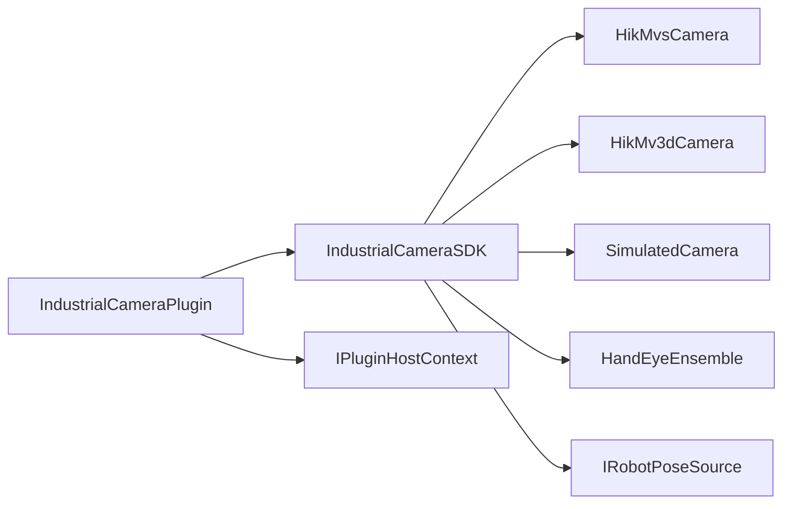

# DESIGN — 工业相机插件

## 架构

## 模块

| 组件 | 职责 |
|------|------|
| CameraTypes / ICamera | 设备信息（含 IP）、帧、内参、连接参数 |
| CameraFactory | enumerate / create by brand |
| HandEyeEnsemble | 滤波 + 多解 + score 择优 |
| ManualPoseSource / RealRobotPoseSource | 末端位姿 |
| CameraResourceStore | resource/industrial_camera 落盘 |
| CameraPanelWidget / HandEyePanelWidget | 双 Tab UI |

## 接口契约

见 `IndustrialCameraSDK/inc/*.h`。

## 异常

- 连接失败：`lastError()` 中文说明
- 缺 SDK：枚举空 + 状态提示；模拟相机仍可用
- 标定失败：跳过失败算法，无可用结果则返回 false

## 数据流

拍照 → Frame → 写 captures/ → 可选 import PLY  
标定样本 → board+robot pose → Ensemble → calibrations/result.json
