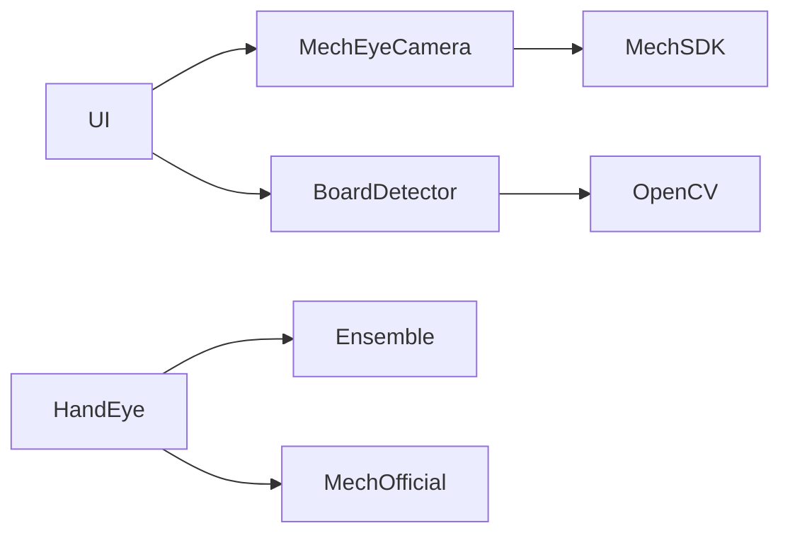

# DESIGN — 工业相机插件二期

| 模块 | 路径 |
|------|------|
| MechEyeCamera | `source/mech/` |
| BoardDetector | `inc/BoardDetector.h` + `source/calib/` |
| MechOfficial | `solveMechOfficialHandEye` in calib |
