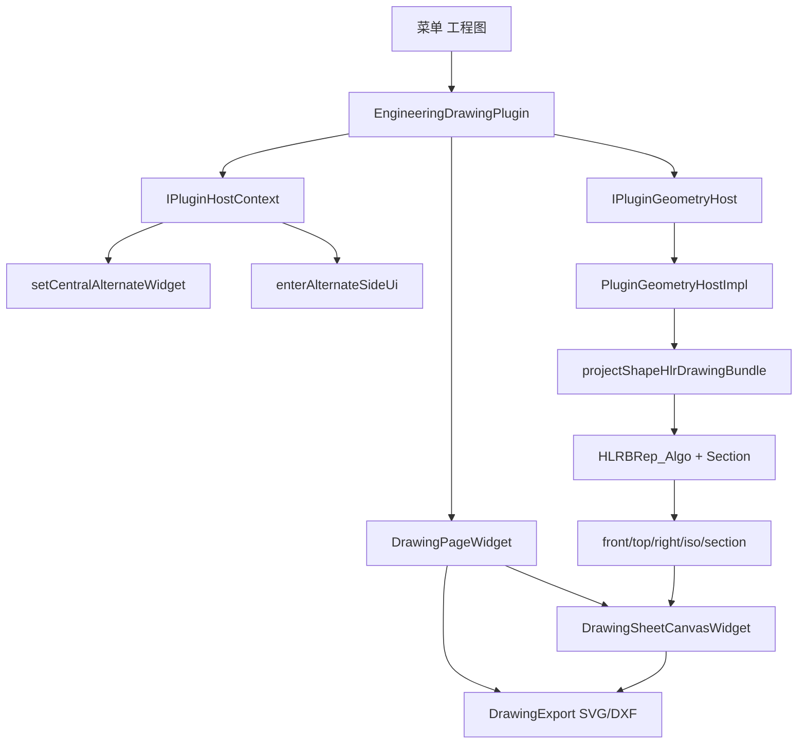

# DESIGN — 三维模型 → 二维工程图

## 整体架构



> 二期补充：角法/轴测/剖视参数经 `PluginDrawingProjectParams`；画布工具含拖视图、线性尺寸、局部放大。


## 核心组件

### GeometryAlgorithm — `HlrProject`

```cpp
enum class HlrViewKind { Front, Top, Right };

struct HlrViewPolylines {
  std::vector<Polyline3d> visible; // xyz 中 z=0，xy 为图面 mm
  std::vector<Polyline3d> hidden;
};

bool projectShapeHlr(const ShapeHandle& shape, HlrViewKind kind,
                     const TessellateParams& params, HlrViewPolylines& out,
                     std::string* errMsg);
bool projectShapeHlrThreeViews(...); // Front+Top+Right
```

投影坐标系（模型 mm，第一角法）：

| 视图 | 视线（投影方向） | 图面 X | 图面 Y |
|------|------------------|--------|--------|
| Front | (0,-1,0) | +X | +Z |
| Top | (0,0,-1) | +X | -Y |
| Right | (1,0,0) | +Y | +Z |

实现：`HLRBRep_Algo` + `HLRBRep_HLRToShape`（V/OutLine/Rg1 合入可见，H/OutLineH 合入隐藏）→ `discretizeShapeEdges` → 取点 xy。

### PluginGeometryTypes

```cpp
struct PluginDrawingHlrViewResult {
  std::string viewId; // "front"|"top"|"right"
  std::vector<std::vector<float>> visibleXy; // x,y,x,y...
  std::vector<std::vector<float>> hiddenXy;
};
struct PluginDrawingHlrResult {
  std::vector<PluginDrawingHlrViewResult> views;
};
using PluginDrawingHlrFinishedFn =
  std::function<void(bool, const QString&, const PluginDrawingHlrResult&)>;
```

### IPluginGeometryHost（末尾追加，1.33.0+）

```cpp
virtual void projectBrepHlrToDrawing(IPluginDocument* doc,
  const std::string& backendIdUtf8, PluginDrawingHlrFinishedFn onFinished) = 0;
```

### 图纸 JSON（侧车 `engineeringDrawing`）

```json
{
  "version": 1,
  "backendId": "...",
  "projection": "firstAngle",
  "views": [
    { "id": "front", "visible": [[x,y,...]], "hidden": [[...]] },
    { "id": "top", ... },
    { "id": "right", ... }
  ]
}
```

### 画布布局（第一角法）

```
        [Top]
[Front] [Right]
```

各视图本地包围盒 + 间距排布；场景坐标为图幅 mm。

## 异常处理

- 无活动文档 / 无 B-rep：日志警告，不进入或禁用生成
- HLR 失败：回调 `ok=false` + 错误文案
- 其它模式 claim：softExit 清侧栏与 alternate
