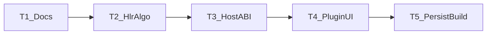

# TASK — 三维模型 → 二维工程图

## 依赖图

## T1 文档

- 输出：ALIGNMENT / CONSENSUS / DESIGN / TASK
- 验收：文档与拍板一致

## T2 HLR 算法

- 输入：ShapeHandle
- 输出：`HlrProject.h/.cpp`，GeometryAlgorithm 链 TKHLR
- 验收：三视图折线非空（对简单盒体）

## T3 宿主 ABI

- 输入：T2
- 输出：Types / IPluginGeometryHost / Impl；版本 1.33.0；`kProjectKeyEngineeringDrawing`
- 验收：末尾追加、插件可编译链 SDK

## T4 插件 UI

- 输入：T3
- 输出：EngineeringDrawingPlugin（Page/Canvas/侧栏/菜单/模式）
- 验收：进入工作区、生成三视图、缩放平移

## T5 持久化与双配置编译

- 输入：T4
- 输出：save/load；ACCEPTANCE/FINAL/TODO；Debug+Release x64 通过
- 验收：见 CONSENSUS
