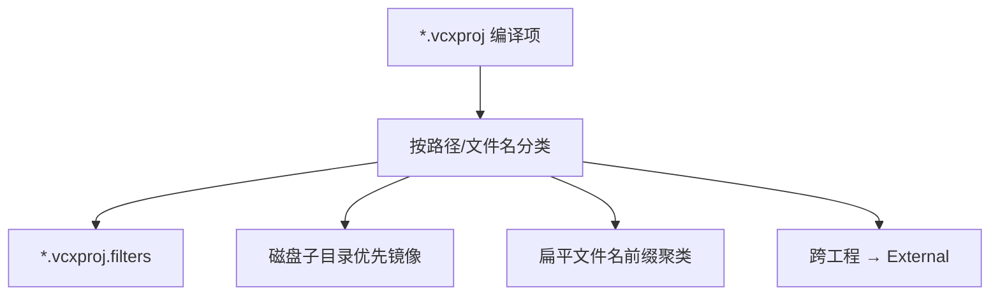

# DESIGN — 工程筛选器整理

## 1. 整体方案

生成器读取 `.vcxproj` 全部相关 Item，写入 `.filters`；不改编译列表。

## 2. 通用规则

| 优先级 | 规则 |
|--------|------|
| 1 | 路径含 `..\..\` 或 `bin\SDK\` 或 `$(...)` → `External\<剥离 .. 后的相对目录>` |
| 2 | 路径含磁盘子目录（`ops\`、`adapters\`、`sdf\`、`sim\`、`discretizers\`、`source\detail\` 等）→ 镜像为筛选器路径 |
| 3 | `inc\*.h` → `inc\<功能>`；`source\*.cpp` / `src\*.cpp` → `src\<功能>` |
| 4 | `pch.*` / `*_global.h` / 导出桩 → `inc\Global` 或 `src\Global` |
| 5 | Builtins：`ops\<Name>\*` → Filter `ops\<Name>`（头源同夹，不拆 inc/src） |

## 3. 大工程功能映射

### TrajectoryAlgorithmBuiltins
- `inc\` / `src\` → `inc\Common` / `src\Common`
- `ops\<Op>\*` → `ops\<Op>`

### GeometryAlgorithm
| 功能夹 | 匹配 |
|--------|------|
| Shape / Brep | Shape*, Brep*, Primitive*, Shell*, Wire*, Intersection*, Types, ViewTessellate, TemplateBrep* |
| FeatureDiscretize | Feature*, IFeature*, Discretize* |
| Mesh | Mesh*, GeoMesh* |
| Trajectory | Trajectory*, Tubular* |
| SelfTest / Global | SelfTest*, *_global |
| discretizers | 磁盘 `discretizers\` |
| src\detail | `source\detail\` |
| src\MeshSurfaceReconstruction | 磁盘子树 |
| src\TubularGrinding | 磁盘子树 |

### Widget
| 夹 | 匹配 |
|----|------|
| MainWindow | MainWindow*, DocumentPage, RunInfoPage, ApplicationStyle, StyledDock*, Viewport*, ViewPreset* |
| OsgWidget | OsgWidget*, QWidgetViewer, WidgetOsg*, WidgetRender*, WidgetDocument*, WidgetScene* |
| BackendTree | Backend* |
| PickOperations | *Pick*, *Operation*, ObjectTransform*, Selection*, Labeling*, MeshSection*, RobotTcp* |
| Infrastructure | JobSystem, ProgressManager, GraphicsWindow*, LitMesh*, QtKeyboard*, ProjectPackage*, pch, widget_global |
| External | Host 头、qtpropertybrowser |

### RobotWidget
| 夹 | 匹配 |
|----|------|
| Interfaces | IRobot* |
| RobotSettings | RobotAxis*, RobotCollision*, RobotFrame*, RobotExternal*, RobotComm*, DevicePage*, RobotUrdf*, RobotProject* |
| TrajectoryUi | Trajectory* |
| FeatureTrajectory | Feature*, MeshTrajectory*, MeshTriangle* |
| Instructions | Instruction*, ProgramEdit*, PlanResult*, BrandProgram* |
| Simulation | Simulation*, RobotSimulation*, BackendCollision*, PythonScript* |
| Global | robotwidget_global |

### Data
| 夹 | 匹配 |
|----|------|
| Core | BackendData*, BackendRegistry*, BackendComponent*, BackendProperty*, BackendRelations*, BackendObject*, Property* |
| HierarchyFollow | BackendHierarchy*, BackendFollow*, FollowAttachment* |
| GeometryBackends | Mesh*, Brep*, PointCloud*, Frame*, Geometry*, PlyIo, geometry_base64 |
| SpatialPrimitive | BackendSpatial*, BackendPrimitive* |
| Global | data_global, pch, CloudSimCoreExport |

### RobotScene
| 夹 | 匹配 |
|----|------|
| Instructions | RobotInstruction*, InstructionProgram*, ProgramEdit* |
| ProgramExport | RobotProgram*, RobotCanonical*, Recipe*, ProcessFlowPreset* |
| KinematicsFrames | RobotSceneKinematics, RobotCoordinate*, RobotExternal*, RobotTeach*, ExternalAxis*, RobotPerLink*, RobotMatrix* |
| Trajectory | Trajectory*, RawTrajectory*, Unified*, *Ingress, PathPlan* |
| CollisionGeometry | RobotCollision*, RobotSceneGeometry* |
| Interfaces | IRobot* |
| Global | robot_scene_global, CloudSimCoreExport |
| resource\* | 保留现有 resource 镜像 |

### CloudSimHost
| 夹 | 匹配 |
|----|------|
| DocumentHost | DocumentHost*, CloudSimHost*, CloudSimApplication* |
| ImportIo | Backend*Import, ProjectPackage*, Annotation*, HierarchyMesh*, BackendProject*, BackendFile*, BackendFollow*, BackendHierarchy* |
| Robot | Robot*, Urdf*, PerLink*, IPerLink*, IRobot* |
| adapters | `adapters\` 镜像 |
| Visual | BackendVisual*, Selection*, HostRender* |
| Global | *_global, pch |

### PointCloudAlgorithm
- 保留 `sdf` / `spare`；其余：Core、Preprocess、Registration、Reconstruction、Global

### ProcessFlowPlugin / IndustrialCameraSDK
- 镜像 `sim\`、`calib\`/`hik\`/`mech\`/`pose\`；UI / Plugin / Core 按名聚类

## 4. 异常处理

- vcxproj 有、磁盘无：仍写入 filters（路径以 vcxproj 为准）
- 无法归类：落入 `inc\Other` / `src\Other`
- 生成后抽查大工程 Filter 树与项计数一致
