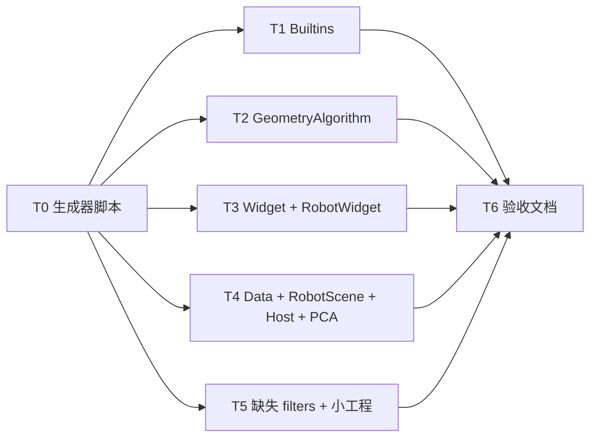

# TASK — 工程筛选器整理

## 依赖图

## T0 — 筛选器生成脚本

- **输入**：CONSENSUS / DESIGN 规则
- **输出**：`tools/RegenerateProjectFilters.ps1`（或一次性运行脚本）
- **验收**：可对指定工程 dry-run 打印分类结果

## T1 — TrajectoryAlgorithmBuiltins

- **输出**：更新 `.filters`，`ops\<Op>` 顶层 + `inc\Common` / `src\Common`
- **验收**：每个 op 文件夹独立筛选器；无扁平堆叠

## T2 — GeometryAlgorithm

- **输出**：功能夹 + `discretizers` / `detail` / 流水线子树镜像
- **验收**：MeshSurfaceReconstruction、TubularGrinding 在独立筛选器下

## T3 — Widget + RobotWidget

- **输出**：按 DESIGN 功能夹；跨工程 → `External`
- **验收**：Host 头与 qtpropertybrowser 在 External

## T4 — Data / RobotScene / CloudSimHost / PointCloudAlgorithm

- **输出**：按 DESIGN 更新
- **验收**：RobotScene 保留 resource；PCA 保留 sdf/spare

## T5 — 缺失 filters + 小工程轻量

- **输出**：CollisionAlgorithm、RobotCommSDK、IndustrialCameraSDK、IndustrialCameraPlugin、ProcessFlowPlugin 新建 filters；其余 SLN 工程轻量细分
- **验收**：SLN 39 工程均有 `.filters`

## T6 — Assess

- **输出**：ACCEPTANCE / FINAL / TODO
- **验收**：文档列出完成工程与遗留项
