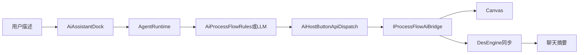

# DESIGN — 工艺流程 AI 助手

## 分层

| 层 | 组件 |
|----|------|
| UI | MainWindow 流程模式 tabify AI；Dock 域下拉 Process flow |
| Agent | Router / PlanBuilder / Catalog |
| Host | PluginHostContext 桥接指针 |
| Plugin | ProcessFlowAiBridge / Canvas / DES |

## 接口契约

`IProcessFlowAiBridge`：`ensureEntered` / `applyFlowJson` / `runSimSync` / `compareSync` / `exportFlowJson`

## 异常

- 桥接 null → Dispatch 返回明确错误
- `SimModelBuilder` 失败 → 不写画布
- 无活动文档 → ensureEntered 失败
