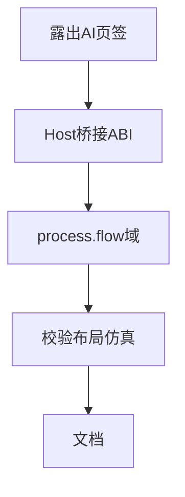

# TASK — 工艺流程 AI 助手

| ID | 任务 | 验收 |
|----|------|------|
| T0 | enter/exitProcessFlowSideUi tabify AI | 流程模式可见助手 |
| T1 | IProcessFlowAiBridge + 1.20.0 | 插件注册/注销 |
| T2 | Catalog/Dispatch/Router/Dock/Agent | 工具可执行 |
| T3 | 校验+autoLayout+同步 DES 摘要 | 冒烟口语通过 |
| T4 | README + docs/工艺流程AI助手 | 文档齐全 |
