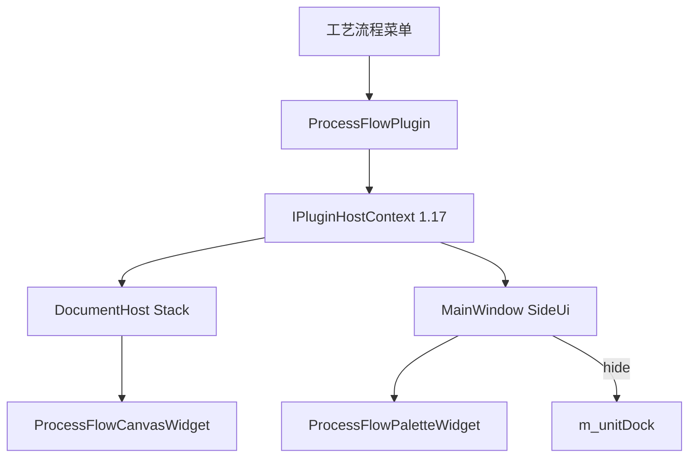

# DESIGN — 工艺流程仿真插件（MVP）

## 整体架构

## 分层

| 层 | 组件 | 职责 |
|----|------|------|
| 宿主 | DocumentHost | 中央 3D/画布堆栈 |
| 宿主 | MainWindow | 右侧模式切换 |
| 契约 | IPluginHostContext | 插件可调用的切换 API |
| 插件 | ProcessFlowPlugin | 菜单、创建画布/节点库 |
| 插件 | ProcessFlowCanvasWidget | 自研节点图编辑 |
| 插件 | ProcessFlowPaletteWidget | 节点类型列表 |

## 接口契约（vtable 末尾）

- `setCentralAlternateWidget(QWidget*)`
- `showCentralScene3D()` / `showCentralAlternate()` / `isShowingCentralAlternate()`
- `enterProcessFlowSideUi(QWidget* palette)` / `exitProcessFlowSideUi()`

## 异常

- 无活动文档：菜单操作打日志并返回
- 重复进入：复用已有画布与 palette，不重复创建
