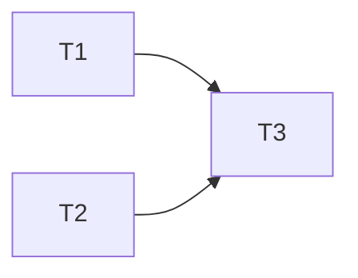

# TASK — 工艺流程仿真插件（MVP）

## T1 宿主中央堆栈与右侧模式

- 输入：现有 DocumentHost / MainWindow / PluginHostContext
- 输出：1.17 API 可用；进入/返回切换正确
- 验收：无插件时 API 可空操作；有插件时单元 Dock 隐藏/恢复

## T2 自研画布

- 输入：NodeFlowDemo 行为参考（不 include）
- 输出：`ProcessFlowCanvasWidget`
- 验收：拖拽/连线/缩放/删/导出 JSON

## T3 插件 UI

- 输入：T1/T2
- 输出：ProcessFlowPlugin + plugin.json + vcxproj
- 验收：菜单进入后右侧仅节点库；中央画布可编辑

## 依赖

