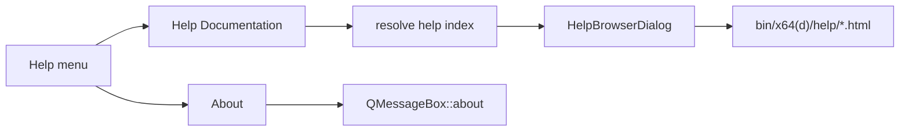

# DESIGN — 帮助系统

## 整体架构



## 分层与组件

| 组件 | 模块 | 职责 |
|------|------|------|
| Help 菜单 | Widget `MainWindowUiSetup` | 注册菜单与 action |
| i18n | Widget `MainWindow::applyLanguage` | 中英标题 |
| 打开逻辑 | Widget `MainWindowHelp.cpp` | 解析路径、缺文件警告、About |
| 浏览器 | Widget `HelpBrowserDialog` | `QTextBrowser` 展示 HTML |
| 静态资源 | `CloudSim/help/` | zh/en 入口页 |
| 部署 | `CloudSim.vcxproj` PostBuild | 拷贝到 OutDir |

## 接口契约

- `MainWindow::onOpenHelpDocumentation()`：按 `m_useChinese` 选 `help/zh` 或 `help/en`
- `MainWindow::onAboutCloudSim()`：产品名 + 一句定位
- `HelpBrowserDialog(parent, title, htmlFilePath)`：`setSource(QUrl::fromLocalFile(...))`

## 数据流

```
用户点击帮助文档
  → applicationDirPath()/help/{lang}/index.html
  → 存在？ HelpBrowserDialog::show() : QMessageBox::warning
```

## 异常处理

| 情况 | 策略 |
|------|------|
| HTML 不存在 | warning，不打开空窗 |
| 相对链接资源缺失 | QTextBrowser 默认行为；入口页不依赖外链 |
