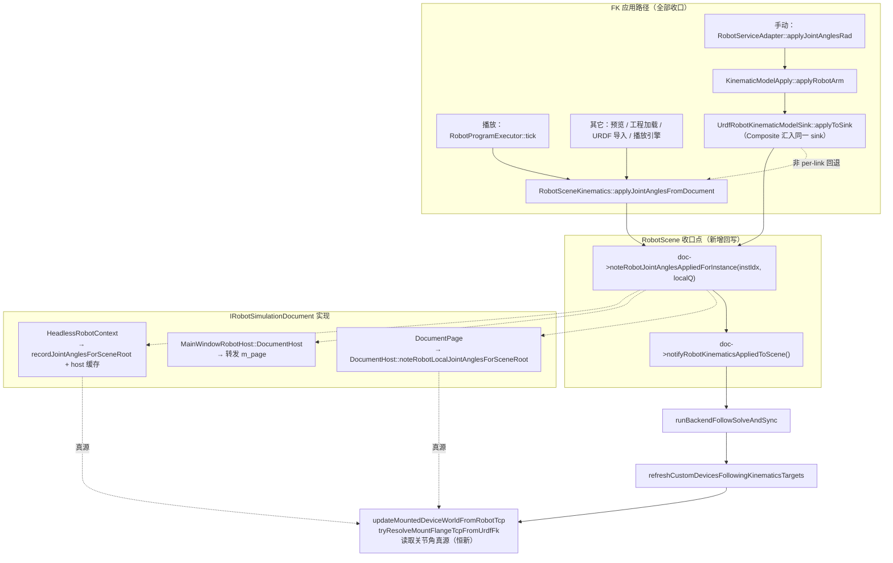
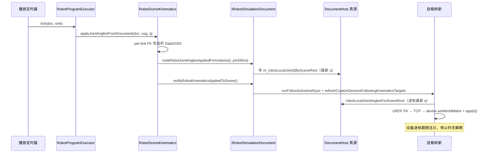

# DESIGN_机器人挂载跟随修复

## 整体架构



## 分层设计

| 层 | 模块 | 职责 |
|---|---|---|
| 接口 | RobotScene `IRobotSimulationDocument` | 新增回写虚函数（默认空实现，不强制实现方） |
| 收口 | RobotScene `RobotSceneKinematics` / `UrdfRobotKinematicModelSink` | FK 应用成功当场回写本实例关节角 |
| 状态 | CloudSimHost `DocumentHost` | `m_robotLocalJointQBySceneRoot` 真源；`noteRobotLocalJointAnglesForSceneRoot` 直写 local |
| 桌面实现 | Widget `DocumentPage` | instIdx → sceneRoot → 写真源 |
| 适配 | Widget `MainWindowRobotHost::DocumentHost` | 包装转发（播放路径经此对象） |
| Headless | CloudSimHost `HeadlessRobotContext` | 双写自有缓存 + host 缓存 |
| 事件 | CloudSimHost `DocumentHostEvents` | `publishRobotKinematicsApplied` 纯化为事件发布 |

## 接口契约

```cpp
// RobotScene/inc/IRobotSimulationDocument.h
/// FK 收口回写：本实例当前关节角（rad）写入文档真源，供挂载设备 TCP 重算等读取
virtual void noteRobotJointAnglesAppliedForInstance(int instanceIndex, const QVector<double>& localJointRad);
```

| 契约项 | 约定 |
|---|---|
| 调用时机 | 仅在 FK 成功写入场景后、notify 前/伴随调用 |
| 参数 | `instanceIndex` 为机器人实例下标；`localJointRad` 为本实例局部关节角（rad，非聚合向量） |
| 线程 | 与现有 FK 应用同线程（UI 线程 / Headless 播放定时器线程） |
| 默认实现 | 空（不强制；mock/未来实现可忽略） |
| 幂等 | 同值重复写入无副作用（QHash insert 覆盖） |

## 数据流（修复后播放路径）



## 异常处理策略

| 场景 | 行为 |
|---|---|
| instIdx 越界 / sceneRoot 为空 | 实现侧静默 return（与现有防御风格一致） |
| localJointRad 为空 | `noteRobotLocalJointAnglesForSceneRoot` 静默 return |
| FK 失败 | 不回写（保持上一次真值），沿现有 `return false` 路径 |
| legacy 回退路径（nInst==0） | 无实例概念，不回写（挂载依赖 per-link 绑定，该路径无消费者） |
| 多实例 | 每实例独立回写；挂载刷新按 `mount->robotSceneBackendId` 查对应实例缓存 |

## 性能评估

播放每帧每实例一次 `QHash::insert`（nj≤7 的 `QVector<double>` 拷贝），O(nj)，相对每帧 FK + follow 求解开销可忽略。
