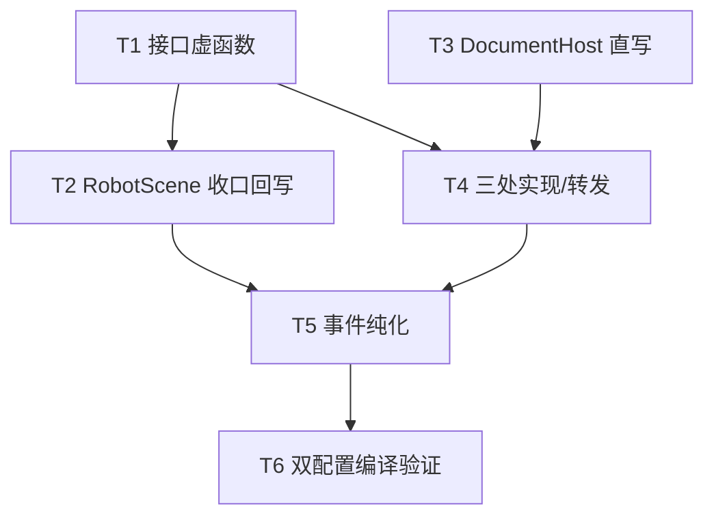

# TASK_机器人挂载跟随修复

## 原子任务拆分

### T1 接口：IRobotSimulationDocument 新增回写虚函数

- **输入契约**：无前置依赖；`RobotScene/inc/IRobotSimulationDocument.h`
- **输出契约**：`noteRobotJointAnglesAppliedForInstance(int, const QVector<double>&)` 默认空实现，置于 `notifyRobotKinematicsAppliedToScene` 旁
- **实现约束**：纯中文注释聚焦 Why；不改现有虚函数
- **验收**：RobotScene 单独编译通过

### T2 收口回写：RobotScene 两处

- **输入契约**：T1 完成
- **输出契约**：
  - `RobotSceneKinematics.cpp::applyJointAnglesFromDocument`：per-link 分支（`applyJointAnglesViaLinkBackends` 成功后）与层级分支（`applyRobotJointLocalMatrices` 后）各回写一次；
  - `UrdfRobotKinematicModelSink.cpp::applyToSink`：per-link 分支 `applyLinkWorldFromCoreFk` 成功后、notify 前回写（`local` 现成）
- **实现约束**：FK 失败路径不回写；legacy nInst==0 回退不回写
- **验收**：RobotScene 编译通过

### T3 状态层：DocumentHost 直写语义

- **输入契约**：无（可与 T1/T2 并行）
- **输出契约**：`noteRobotLocalJointAnglesForSceneRoot(sceneRoot, localJointRad)` 改为直写 local（去除聚合切片与 importContext 依赖）；头文件注释同步
- **实现约束**：原聚合版调用方仅 `DocumentHostEvents.cpp:45` 与 `CustomDeviceHostOps.cpp:137`，由 T5 清除
- **验收**：CloudSimHost 编译通过（T5 完成后）

### T4 实现侧：三处 override + 一处转发

- **输入契约**：T1 + T3
- **输出契约**：
  - `DocumentPage`（Widget inc/source）：override，经 `robotSceneBackendIdForInstance` 解析 sceneRoot 后写 DocumentHost 缓存；
  - `MainWindowRobotHost::DocumentHost`（Widget）：包装类转发 `m_page`（与 `:343` notify 转发同风格）；
  - `HeadlessRobotContext`（CloudSimHost inc/source）：override，`m_robots[instIdx].sceneBackendId` → `recordJointAnglesForSceneRoot` + `m_host.noteRobotLocalJointAnglesForSceneRoot` 双写
- **验收**：Widget / CloudSimHost 编译通过

### T5 事件纯化与冗余清理

- **输入契约**：T2 + T4（新写源已就位）
- **输出契约**：
  - `DocumentHostEvents.cpp::publishRobotKinematicsApplied` 移除缓存写入行，仅发事件；
  - `CustomDeviceHostOps.cpp::applyRobotFkBeforeDeviceMount` 移除 `:136-137` 两处显式回写（`aggregated` 仍作为出参保留）
- **验收**：CloudSimHost 编译通过；`noteRobotLocalJointAnglesForSceneRoot` 无聚合语义残留调用方

### T6 双配置编译验证

- **输入契约**：T1–T5 完成
- **输出契约**：RobotScene → CloudSimHost → Widget → RobotWidget → CloudSimWebGateway 依赖链，Debug|x64 与 Release|x64 各编一遍，0 error
- **实现约束**：msbuild 各 vcxproj；不改 OutDir；产物目录以工程为准

## 任务依赖图

（T1 与 T3 可并行；T2 依赖 T1；T4 依赖 T1+T3；T5 依赖 T2+T4；T6 最后）

## 复杂度评估

| 任务 | 改动文件 | 量级 |
|---|---|---|
| T1 | 1 头文件 | 5 行 |
| T2 | 2 源文件 | 3 行 |
| T3 | 1 头 + 1 源 | ~15 行（删多于增） |
| T4 | 3 头/源 + 1 源 | ~30 行 |
| T5 | 2 源文件 | 删 3 行 |
| T6 | — | 编译 |
