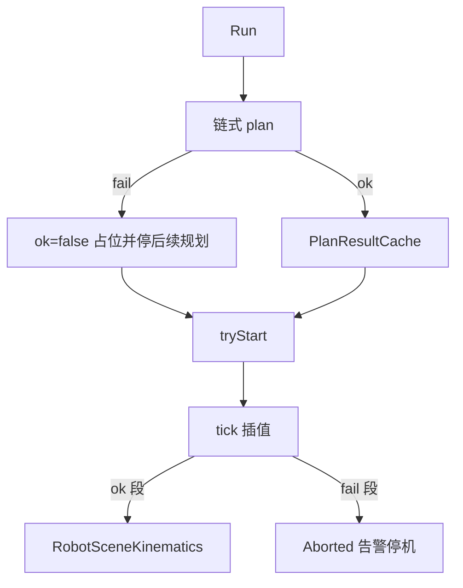

# DESIGN：机器人指令执行 / 预览 / 运行

## 运行时数据流

## 核心契约

| 组件 | 契约 |
|------|------|
| `PlanResult.ok` | false 表示该运动不可播 |
| `jointTrajectoryRad` | ≥2 点时 Executor 优先使用；**Run 接入不得清空**（点云/LINE 插帧依赖） |
| `LinePlanner` | URDF：笛卡尔插值 + 递推 IK；失败则整段 plan 失败 |
| 外轴播放 | Widget 用 `motionSegmentProgress01` 对 `externalAxisQ` 插值；时长含 \|Δqe\| |

## 异常

- 全失败：不 `tryStart`
- 部分失败：启动后在失败段 `Aborted`，RunInfo 区分「启动前部分失败提示」与「停机提示」
