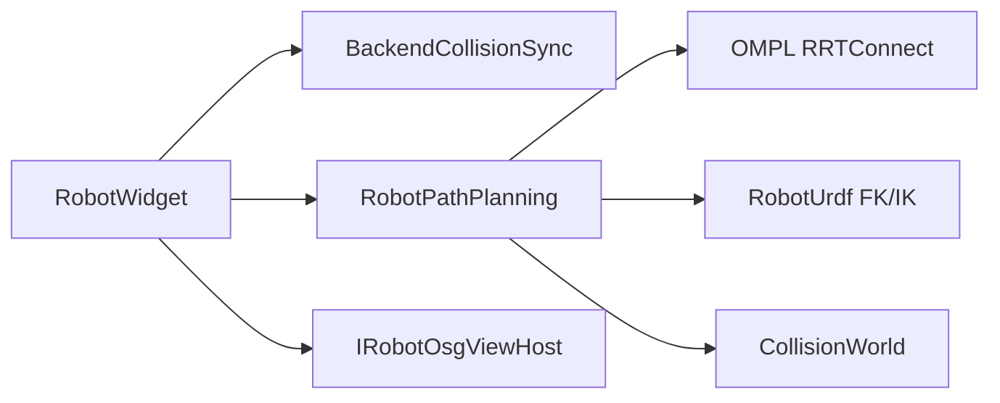

# DESIGN — RobotPathPlanning

## 架构

## API

见 [`机器人路径规划/inc/RobotPathPlanning.h`](../../src/Robot/RobotPathPlanning/inc/RobotPathPlanning.h)。

## 碰撞有效性

`q` → URDF `computeMeshWorldMatrices` → 各 `robotLink` `setWorldPose` → `checkAll`；边按 `longestValidSegmentRad` 离散。

## TCP 输出

`computeLinkWorldRigidTransforms` → flange → `engine::toolOriginFromFlange`。
