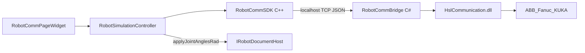

# DESIGN — 机器人通讯

## 架构



## 模块

| 模块 | 职责 |
|------|------|
| `RobotCommPageWidget` | Dock Tab：品牌 / IP / 连接 / 镜像 / 采样率 / 反馈显示 |
| `RobotSimulationController` | 定时 `get_feedback`、镜像开关、写场景 |
| `RobotCommSDK` | `IRobotMotionClient`、TCP JSON 客户端、工厂 |
| `RobotCommBridge` | HSL 授权、Adapter 池、协议翻译、TCP 服务 |
| `AbbHslAdapter` / `FanucHslAdapter` / `KukaHslAdapter` | 品牌读反馈 → 统一 DTO |

## IRobotMotionClient（草案）

```cpp
// RobotCommSDK/inc/IRobotMotionClient.h
struct RobotConnectionConfig {
    std::string brand;      // "ABB" | "Fanuc" | "KUKA"
    std::string bridgeHost; // 默认 "127.0.0.1"
    int bridgePort;         // 默认 19500
    std::string robotHost;
    int robotPort;
    std::string user, password; // ABB RWS
    int pollMs;
};

struct ToolPoseInBase {
    double positionMm[3];
    double eulerDeg[3];     // ZYX，与 spatial contract 一致
};

struct RobotFeedback {
    std::vector<double> jointRad;
    ToolPoseInBase toolPoseInBase;
    std::string brand;
    std::string controllerState;
    int64_t timestampMs;
};

class IRobotMotionClient {
public:
    virtual ~IRobotMotionClient() = default;
    virtual bool connect(const RobotConnectionConfig& cfg) = 0;
    virtual void disconnect() = 0;
    virtual bool isConnected() const = 0;
    virtual bool ping() = 0;
    virtual bool getState(std::string& stateJsonOut) = 0;
    virtual bool getFeedback(RobotFeedback& out) = 0;
    virtual std::string lastError() const = 0;
};

ROBOTCOMM_SDK_EXPORT std::unique_ptr<IRobotMotionClient> createRobotMotionClient();
```

## Bridge JSON 协议

单端口 TCP；**一行一条 JSON**（UTF-8，`\n` 结尾）。响应同样一行 JSON。

| cmd | 请求字段 | 响应 |
|-----|----------|------|
| `connect` | `brand`, `host`, `port`, `user?`, `password?` | `{ ok, code?, message? }` |
| `disconnect` | — | `{ ok }` |
| `ping` | — | `{ ok, pong: true }` |
| `get_state` | — | `{ ok, brand, controllerState, connected }` |
| `get_feedback` | — | `{ ok, jointRad[], toolPoseInBase{positionMm,eulerDeg}, timestampMs, ... }` |

错误统一：`{ ok: false, code, message }`（中文 message 优先）。

示例：

```json
{"cmd":"connect","brand":"Fanuc","host":"192.168.0.10","port":8193}
{"cmd":"get_feedback"}
```

## 单位与品牌映射

| 品牌 | HSL 类 | 读 API | 原始单位 | Bridge 转换 |
|------|--------|--------|----------|-------------|
| ABB | `ABBWebApiClient` | `GetJointTarget` / `GetRobotTarget` | deg / mm | → `jointRad` / `toolPoseInBase` |
| Fanuc | `FanucInterfaceNet` | `ReadFanucData`；地址 **D751** 位姿、**D777** 关节（`ReadFloat`） | deg / mm | deg→rad |
| KUKA | `KukaTcpNet` | `ReadString("$AXIS_ACT")` / `$POS_ACT` 等 | 字符串解析 | 按 HSLCLI 约定解析 → rad/mm/deg |
| KUKA（备选） | `KukaAvarProxyNet` | `ReadString("$AXIS_ACT")` / `$POS_ACT` | 字符串 | 同上 |

关节顺序与 URDF 轴序对齐由 Adapter 内 `jointMap` 配置；外部轴 `externalAxisQ[]` 可选二期。

## 异常策略

| 场景 | 处理 |
|------|------|
| Bridge 未启动 / TCP 失败 | SDK `lastError` 中文提示；UI 显示断开 |
| HSL 授权失效（8h 试用） | Bridge 日志警告；`get_feedback` 返回 `{ ok:false, code:"AUTH" }` |
| 机侧未就绪（RWS / Fanuc 以太网 / KUKA 程序） | Adapter 捕获 `OperateResult`；不崩溃 |
| 镜像中反馈断流 | Controller 停止写场景；保留最后一帧或回退由 UI 策略定 |
| 关节数与 URDF 不匹配 | 拒绝镜像并 warning；不强行 `applyJointAnglesRad` |
| 用户断开 | `disconnect` → 停定时器 → 清连接状态 |
