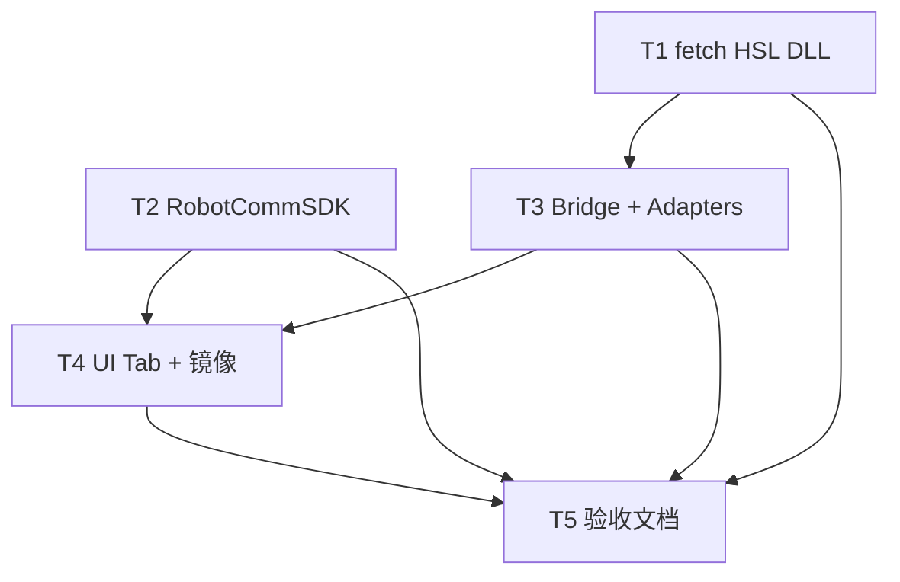

# TASK — 机器人通讯

## 依赖图

## T1 — fetch HSL DLL

- **输入**：NuGet `HslCommunication` 12.9.1；参考 `scripts/fetch_libplctag.ps1`
- **输出**：`scripts/fetch_hslcommunication.ps1`；`bin/SDK/HslCommunication-12.9.1/`（含 `HslCommunication.dll`、`Newtonsoft.Json.dll`）；`README_DEPLOY.md`
- **验收**：脚本执行成功；DLL 存在；可选 `-SourceLocal` 从本机 packages 拷贝

## T2 — RobotCommSDK

- **输入**：T1 完成（Bridge 端口约定）；对齐 `PlcCommSDK` 工程模式
- **输出**：`CloudSim/src/Plugins/RobotCommSDK/`（`IRobotMotionClient.h`、`RobotCommTypes.h`、TCP 客户端、`createRobotMotionClient()`）；`RobotCommSDK.dll`
- **验收**：x64 编译通过；可连 Bridge 发 `ping` / `connect` / `get_feedback`（Mock Bridge 亦可）

## T3 — Bridge + Adapters

- **输入**：T1 SDK 目录 DLL；HSL Demo 参考；robdts `HSLCLI` Fanuc D751/D777、KUKA `KukaTcpNet` 约定
- **输出**：`CloudSim/tools/RobotCommBridge/`（或 `src/Plugins/RobotCommBridge/`）；TCP JSON 服务；`AbbHslAdapter` / `FanucHslAdapter` / `KukaHslAdapter`；`HSL_AUTH_CODE` 可选激活
- **验收**：Bridge 启动；三品牌 Adapter 至少各一条读路径；`get_feedback` 返回统一 DTO；PostBuild 复制 HSL DLL

## T4 — UI Tab + Controller 镜像

- **输入**：T2 SDK；T3 Bridge 可联调
- **输出**：`RobotCommPageWidget`；`RobotSimulationDockWidget` 新增 Tab「机器人通讯」（`kTabIndexRobotComm`）；Controller 连接 / 断开 / 镜像 / 定时 poll → `applyJointAnglesRad`；`DEVELOPER_GUIDE.md` Dock 表补充
- **验收**：Tab 可见；连接状态与反馈显示；镜像开启后场景关节随真机或 Demo Server 更新；断开停写

## T5 — 文档 Assess

- **输入**：T1–T4 完成
- **输出**：`ACCEPTANCE_机器人通讯.md` / `FINAL_机器人通讯.md` / `TODO_机器人通讯.md`（授权、机侧配置、联调清单）；`ARCHITECTURE_SUMMARY.md` / `MODULE_DEVELOPER_GUIDES.md` 一行
- **验收**：6A 闭环；TODO 列明 RWS 账号、Fanuc 以太网、KUKA 程序、商用授权步骤
