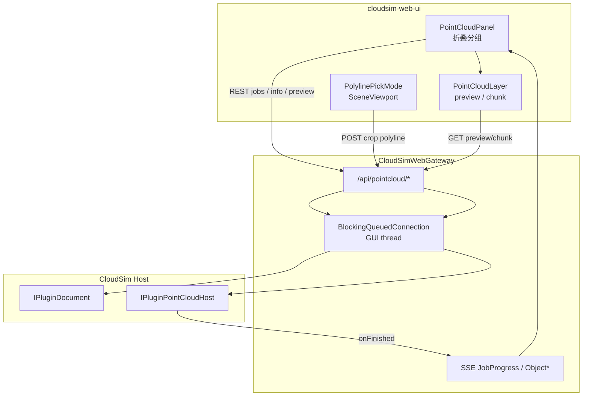
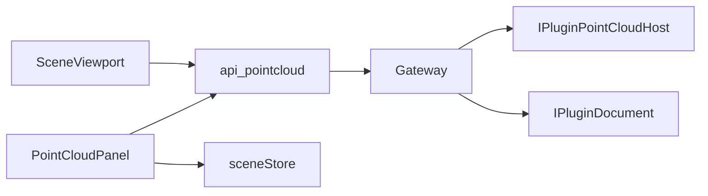
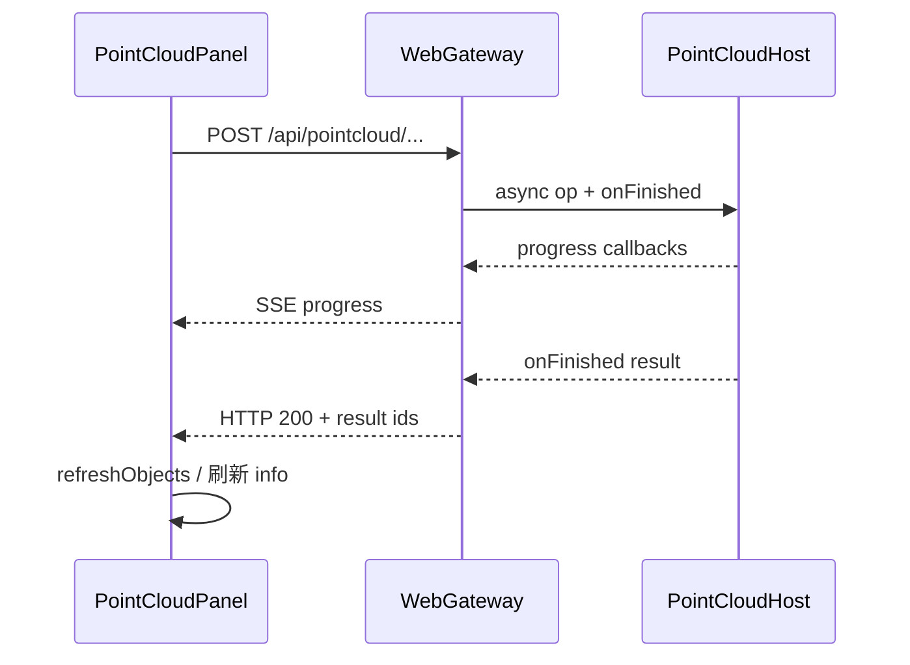
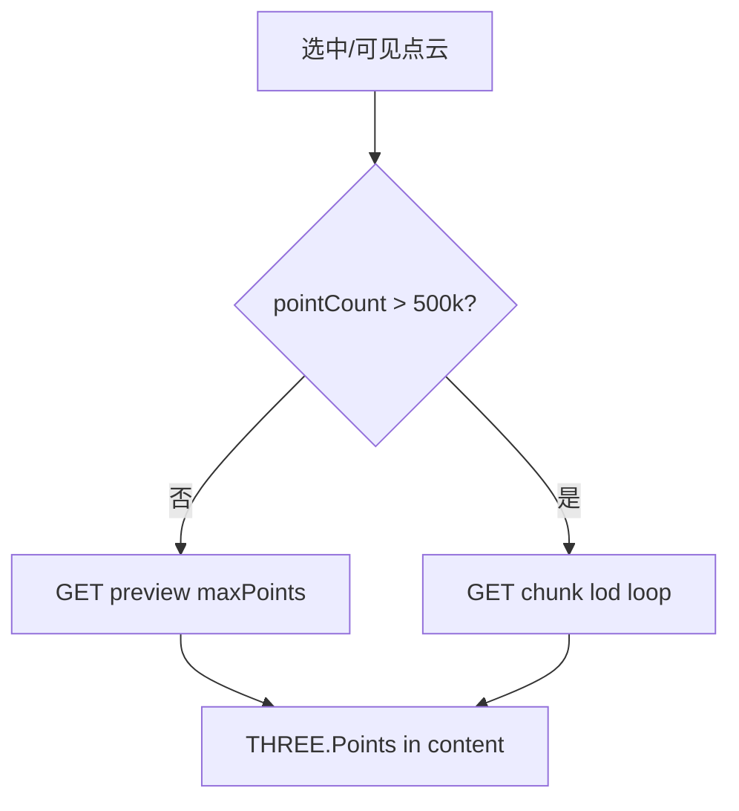
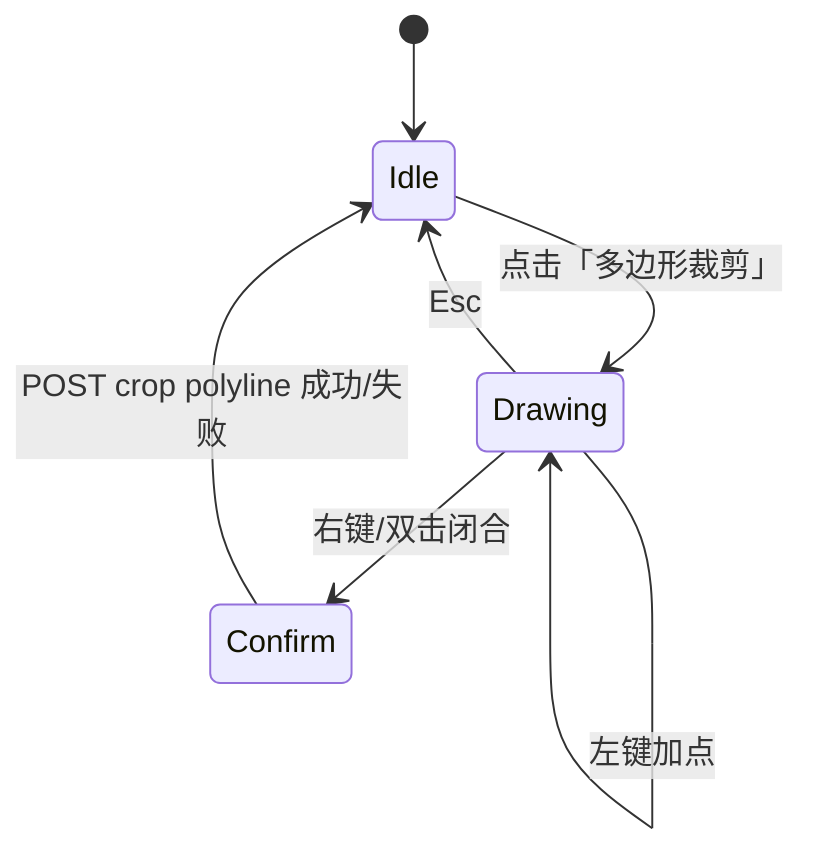

# DESIGN — 点云网页同步

> 上游：`CONSENSUS_点云网页同步.md`

## 1. 整体架构

## 2. 分层与核心组件

| 层 | 组件 | 职责 |
|----|------|------|
| UI | `PointCloudPanel.tsx` | 替换 `GeometryOpsPanel`；桌面顺序折叠区 |
| UI | `pointCloudStore`（可选） | 选中点云 id、作业 busy、曲面会话状态、日志 |
| UI | `SceneViewport` 点云层 | `geometryKind===1`：preview Points 或 chunk 拼接 |
| UI | 多边形拾取 | 与轨迹 pick 类似的交互状态机 |
| API | `api/pointcloud.ts` | typed REST 封装 |
| GW | `WebGateway` 路由 | 真接 Host，去掉 stub |
| GW | 可选 `HeadlessPointCloudBridge` | 集中 params JSON ↔ Plugin*Params、进度转发（避免 Gateway 文件膨胀） |

## 3. 模块依赖

不依赖：Tubular / CAD template / geometry boolean。

## 4. 接口契约（REST）

约定：JSON camelCase；长度单位 mm；异步作业可立即 `{ok,accepted}` + SSE，或同步等到 `onFinished`（首期优先 **同步等待 GUI 回调完成再 HTTP 响应**，SSE 并行推 progress，实现更简单；超时大作业再改为 jobId 轮询）。

### 4.1 查询

| Method | Path | 说明 |
|--------|------|------|
| GET | `/api/pointcloud/list` | 点云 backend 列表（或复用 `/api/objects` 滤 `geometryKind===1`） |
| GET | `/api/pointcloud/info/:id` | 映射 `queryPointCloudInfo` / measure |
| GET | `/api/pointcloud/preview/:id?maxPoints=` | float32 xyz 或 xyzrgb；服务端均匀/体素抽稀 |
| GET | `/api/pointcloud/chunk/:id?lod=&index=` | LOD 块；超阈值路径 |

### 4.2 作业（示例）

| Method | Path | Body 要点 | Host |
|--------|------|-----------|------|
| POST | `/api/pointcloud/downsample` | `{backendId, mode:"voxel"|"random", ...}` | voxel/random |
| POST | `/api/pointcloud/crop` | `{backendId, mode:"box"|"sphere"|"polyline", ...}` | crop* |
| POST | `/api/pointcloud/preprocess` | `{backendId, op:"outliers"|"bilateral"|"normalsPca"|"normalsMst", ...}` | 对应四 API |
| POST | `/api/pointcloud/register` | `{method:"icp"|"spare"|"sdf", sourceId, targetId, ...}` | ICP/SPARE/SDF |
| POST | `/api/pointcloud/reconstruct` | `{backendId, method:"poissonAuto"|"scaleSpace", ...}` | reconstruct* |
| POST | `/api/pointcloud/mesh/export-ply` | `{backendId, path?}` | `exportMeshToPly`（或 dialog） |
| POST | `/api/pointcloud/mesh/post` | `{backendId, op:"simplify"|"smooth"|"repair"|"remesh", ...}` | VCG 系列 |
| POST | `/api/pointcloud/surface/run` | `{backendId, mode:"full"|"stage", stage?, params}` | surface session |
| POST | `/api/pointcloud/surface/reset` | `{backendId?}` | clear session |

导入继续：`POST /api/objects/import` + `isPointCloud:true`（已有）。

### 4.3 SSE

- `PointCloudJobProgress`：`{ type, op, progress, message? }`
- 复用现有 `BackendObjectCreated` / `ObjectPatched` / `message` → 前端 `refreshObjects`

## 5. 数据流

### 5.1 作业

### 5.2 混合渲染

- `geomSignature` **纳入** `geometryKind===1`（与 mesh 分开加载路径）。
- 作业后若 id 不变仅点数变：bump preview cache key（可用 info 的 pointCount）。

### 5.3 多边形裁剪

前端维护 `pointsMm[]`（Z-up，与场景 root 一致）；闭合后 POST；不依赖 Qt 视口 pick。

## 6. UI 分区顺序（对齐桌面，已删 CAD）

1. 文档与导入  
2. 点云对象  
3. 选中对象信息  
4. 下采样  
5. 裁剪  
6. 预处理  
7. 配准  
8. 重建网格  
9. ~~CAD 模板~~（不渲染）  
10. 网格后处理  
11. 曲面重构  
12. 状态 / 进度 / 日志（页脚）

去掉：`boolean` 下拉与「执行算法作业」总按钮。

## 7. 异常处理

| 情况 | 策略 |
|------|------|
| 未选中 / 类型不符 | 按钮 disabled + hint |
| Host 版本不足 | 隐藏或 disable + 文案 |
| Vcg 未链接 | 返回 error，UI 提示 |
| 作业失败 | HTTP/SSE error；不静默 |
| 预览过大 | 强制抽稀到 `maxPoints`；超阈值走 chunk |
| 多边形 <3 点 | 前端拦截 |

## 8. 与现有代码的衔接

| 现有 | 动作 |
|------|------|
| `GeometryOpsPanel.tsx` | 替换为 `PointCloudPanel`（或同文件重写） |
| `RightDock.tsx` | Tab 仍「点云」，挂新面板 |
| `WebGateway.cpp` stub op/chunk | 改为真实现 |
| `SceneViewport` skip Points | 增加点云加载分支 |
| `/api/objects/import` | 复用 |
| 轨迹 pick | 交互可参考，状态勿冲突（互斥模式） |

## 9. 测试策略

- **契约**：Gateway 层对 info/preview/downsample 做最小集成测（有则扩；无则手工清单）。
- **前端**：关键 params 组装纯函数单测（阈值、crop body）。
- **手工黄金路径**：每里程碑对照桌面同文件操作一次。
