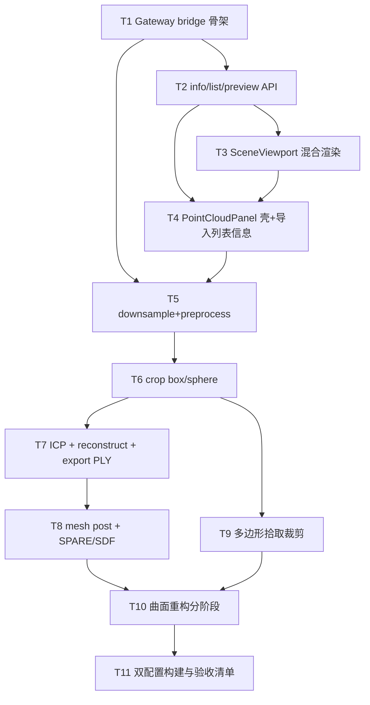

# TASK — 点云网页同步

> 上游：`DESIGN_点云网页同步.md` / `CONSENSUS_点云网页同步.md`  
> 执行前需 **Approve**：确认本任务表后进入 Automate。

## 依赖图

---

## T1 — Gateway PointCloud bridge 骨架

| 项 | 内容 |
|----|------|
| **输入** | `IPluginPointCloudHost.h`；现有 `WebGateway` GUI 排队模式 |
| **输出** | 可挂路由的 bridge（新建或 Gateway 内分区）；stub `/api/pointcloud/op` 标记废弃或转发 |
| **约束** | 仅经 Host/Document；Debug+Release 可编 |
| **验收** | 编译过；至少一条 ping/info 路由可通或占位 501 有统一错误形 |
| **依赖** | — |
| **并行** | 可与 T4 静态 UI 骨架并行（T4 先 mock） |

## T2 — info / list / preview API

| 项 | 内容 |
|----|------|
| **输入** | T1；`queryPointCloudInfo` |
| **输出** | `GET info`、`GET preview`（抽稀 float32）；list 或文档说明复用 `/api/objects` |
| **验收** | 导入点云后 info 有点数；preview 字节数 = N×12（或×24 rgb） |
| **依赖** | T1 |

## T3 — SceneViewport 混合渲染

| 项 | 内容 |
|----|------|
| **输入** | T2 preview；阈值 500k |
| **输出** | `geometryKind===1` 进场景；≤阈值 preview；>阈值 chunk 循环（chunk 可先单块降级为 preview max） |
| **验收** | 小云可见；大云不崩（可先降级提示） |
| **依赖** | T2 |

## T4 — PointCloudPanel 壳（导入/列表/信息）

| 项 | 内容 |
|----|------|
| **输入** | 桌面分区顺序；CONSENSUS |
| **输出** | 替换 `GeometryOpsPanel`；去掉 boolean；折叠分组空壳 + 导入/列表/信息接真 API |
| **验收** | 右坞布局对齐；无 stub 下拉 |
| **依赖** | T2、T3（列表选中联动场景） |

## T5 — 下采样 + 预处理

| 项 | 内容 |
|----|------|
| **输入** | Host downsample/preprocess APIs |
| **输出** | REST + 面板控件 + SSE/状态 |
| **验收** | 体素下采样后点数下降；法线 PCA 后 info 标志变化或对象更新 |
| **依赖** | T1、T4 |

## T6 — 裁剪 box / sphere

| 项 | 内容 |
|----|------|
| **输入** | crop box/sphere Host |
| **输出** | REST + UI（参数对齐桌面默认） |
| **验收** | 裁剪后点数/包围盒变化 |
| **依赖** | T5 |

## T7 — ICP + 重建 + 导出 PLY

| 项 | 内容 |
|----|------|
| **输入** | ICP、PoissonAuto、ScaleSpace、exportMeshToPly |
| **输出** | 配准区（先 ICP）+ 重建区 + 导出 |
| **验收** | ICP 产生对齐结果；重建出 Model；PLY 可导出 |
| **依赖** | T6 |

## T8 — 网格后处理 + SPARE/SDF

| 项 | 内容 |
|----|------|
| **输入** | VCG APIs；SPARE/SDF Host |
| **输出** | mesh post 区；配准方法下拉扩展；版本门控 |
| **验收** | 简化出新网格；SPARE/SDF 在支持 host 可跑或明确 disable |
| **依赖** | T7 |

## T9 — 多边形拾取裁剪

| 项 | 内容 |
|----|------|
| **输入** | T6 crop polyline；SceneViewport 交互 |
| **输出** | 绘制状态机 + POST polyline crop；与轨迹 pick 互斥 |
| **验收** | 左键加点、闭合裁剪、Esc 取消 |
| **依赖** | T6 |

## T10 — 曲面重构

| 项 | 内容 |
|----|------|
| **输入** | surface session Host APIs |
| **输出** | 参数表 + 全流程/分阶段/重置 + 日志区 |
| **验收** | 全流程出 B-rep/结果对象；分阶段按序可走通 |
| **依赖** | T8、T9（顺序上可与 T9 并行，但里程碑放后） |

## T11 — 构建与验收

| 项 | 内容 |
|----|------|
| **输入** | T1–T10 |
| **输出** | `ACCEPTANCE_点云网页同步.md`；Web debug+release；改动的 C++ Debug+Release |
| **验收** | CONSENSUS §5 清单勾完；`TODO_*.md` 列出未决（CAD/特征构建等） |
| **依赖** | T10 |

---

## 复杂度与风险

| 风险 | 缓解 |
|------|------|
| 大点云 preview OOM | 服务端硬顶 maxPoints；超阈值 chunk |
| Headless 无 Qt 视口 pick | 多边形用 Web 采集（已共识） |
| Gateway 文件过大 | T1 抽 bridge 文件 |
| 曲面参数极多 | UI 先对齐桌面默认值，高级项可折叠 |
| 与轨迹 pick 冲突 | 全局 interact/pick 互斥 |

## Approve 检查清单

- [ ] 范围：无特征构建、无 CAD、无 boolean 页
- [ ] 渲染：混合 + 50 万阈值
- [ ] UI：单页折叠，桌面顺序
- [ ] API：经 Host，不直链算法 DLL
- [ ] 里程碑 T1→T11 可接受

**请确认 Approve 后开始 Automate（建议从 T1+T4 壳并行启动）。**
