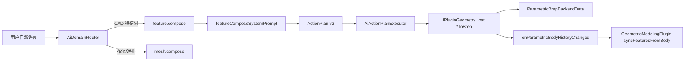

# DESIGN — feature.compose

## 步骤 API

| api | 要点 |
|-----|------|
| askClarify | questions[] |
| extrudeSketchProfileToBrep | mode pad/pocket；profile rectangle/polygon 或 profile_xyz_mm；extrude_mm；target `$id` |
| filletEdgesToBrep | target；radius_mm；edge_indices 或 edges=all |
| linearPatternBodyToBrep | target；count；dx/dy/dz_mm；可选 source_feature_id |

## 同步

`IPluginHostContext::onParametricBodyHistoryChanged(docId, backendId)`（ABI 1.43.0）
