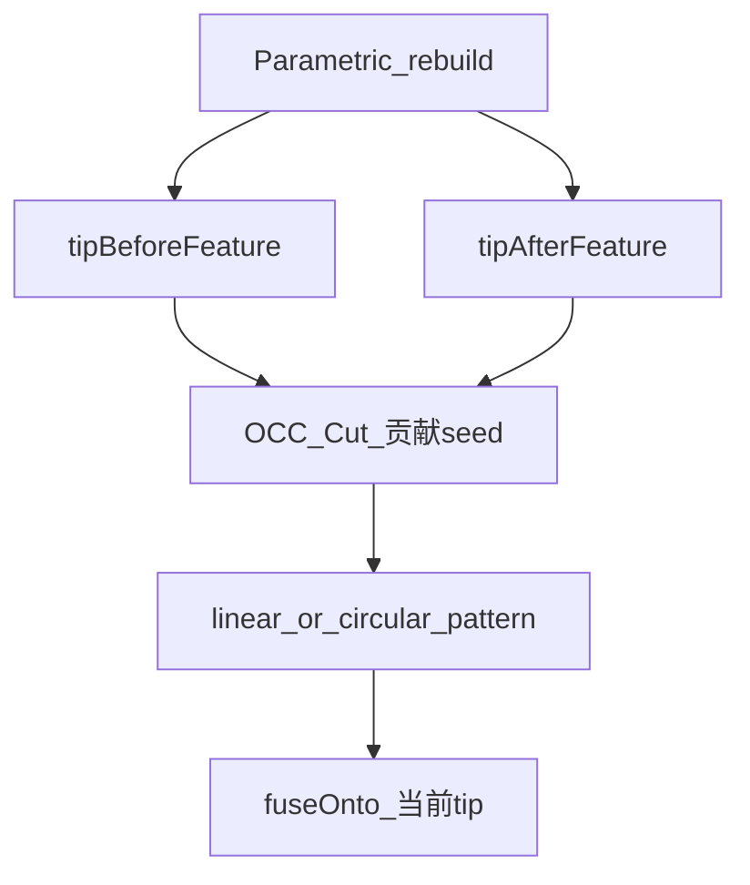

# DESIGN — 特征阵列与拉伸深化

```mermaid
flowchart TB
  Rebuild[Parametric_rebuild]
  Before[tipBeforeFeature]
  After[tipAfterFeature]
  Cut[OCC_Cut_贡献seed]
  Pattern[linear_or_circular_pattern]
  Fuse[fuseOnto_当前tip]

  Rebuild --> Before
  Rebuild --> After
  Before --> Cut
  After --> Cut
  Cut --> Pattern
  Pattern --> Fuse
```

## 拉伸

Blind：先沿法向偏置 `startOffsetMm` 再棱柱 `lengthMm`。  
TwoDirections：正向 `lengthMm` + 反向 `length2Mm` 双棱柱 Fuse（MidPlane = 等长特例）。
