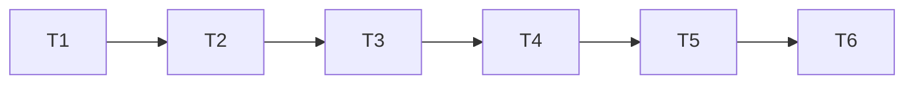

# TASK — 特征阵列与拉伸深化

| ID | 内容 |
|----|------|
| T1 | tipBeforeFeature + Cut seed（线性/圆周） |
| T2 | 成角铰链边方向 |
| T3 | 圆周文档 + 联调 |
| T4 | startOffset + TwoDirections + ABI 1.48 |
| T5 | TopoNaming ALIGNMENT 草案 |
| T6 | 双配置编译 + ACCEPTANCE/FINAL |

