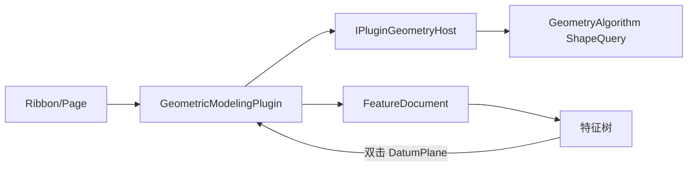

# DESIGN — 硬化 + 基准面入门

## 架构



## 分层

| 层 | 职责 |
|----|------|
| GeometryAlgorithm | `discretizeShapeFaceEdgesToPolylines`；边端点解析可复用现有离散 |
| Host | face 边折线 API；拾取回填 hitWorldMm |
| FeatureDocument | `DatumPlane` kind + plane；JSON 持久化 |
| Plugin | Convert/UpToVertex/Draft/Offset/Polygon/Datum 命令与 UI |

## 接口契约

### Host 1.40.0

```text
PluginGeometryStepRef += hasHitPoint, hitWorldMm
discretizeBackendFaceEdgesToPolylines(doc, faceRef, meshParams, cb)
  → result.polylines = 该面各边界边折线（xyz float）
```

### FeatureDocument

```text
GeomodelingFeatureKind::DatumPlane
plane = 用户平面
无 profile / 不进 Parametric rebuild
```

## 数据流（Convert）

1. 拾取 Face → ref.faceIndex + backendId
2. Host 解析 Shape → collectShapeFaceEdgeIndices[face]
3. 逐边离散 → polylines
4. 投影到当前草图平面（可保留弱共面过滤作容错）

## 异常

- 无边界边 / 非平面中性面 / Offset 自交 → 明确 hostLogWarn，不写坏数据
