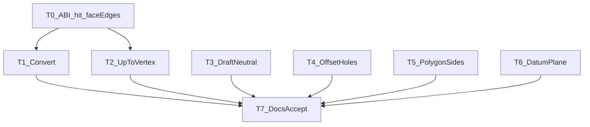

# TASK — 硬化 + 基准面入门

## T0 ABI + ShapeQuery/Host

- 输入：现有 1.39 Host
- 输出：`0x00012800`；hit 点；face 边折线 API
- 验收：插件版本门闩更新；Host 编译通过

## T1 Convert

- 输入：T0
- 输出：`onConvertEntities` 用 face 边折线
- 验收：点选带孔面，孔边也进入草图

## T2 UpToVertex

- 输入：T0 hit 点
- 输出：近端点写入 `setUpToVertex`
- 验收：同一边两端点可分别选中

## T3 Draft 中性面

- 输入：现有 Draft 面板
- 输出：点选中性面 + 预览/确认传参
- 验收：非水平中性面拔模可预览

## T4 Offset

- 输入：`exportClosedProfilesUv` 多环
- 输出：外环+孔环偏移；自交拒绝
- 验收：带孔轮廓偏移后两环均更新；过大距拒绝

## T5 多边形边数

- 输入：`PolygonSketchTool`
- 输出：3–24 可配
- 验收：对话框设 8 边可画出正八边形

## T6 DatumPlane

- 输入：FeatureDocument / 树
- 输出：等距面、三点创建；双击开草图
- 验收：树节点双击进入该平面草图

## T7 文档

- ACCEPTANCE / FINAL / TODO
