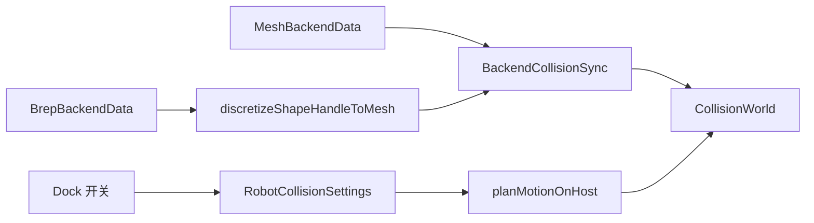

# DESIGN — 碰撞检测

## 架构

## 模块

| 模块 | 职责 |
|------|------|
| CollisionAlgorithm | AABB 宽相 + 三角窄相；可选 coal |
| RobotCollisionSettings | 文档级 enabled / securityMarginMm |
| BackendCollisionSync | 后端几何同步、ACM、轨迹抽样 |
| RobotCollisionSettingsWidget | 仿真 Dock 页签 |

## 开关语义

- 默认 `enabled=false`：plan 不调用碰撞
- `enabled=true`：抽样轨迹 FK → checkAll，命中则 plan 失败
