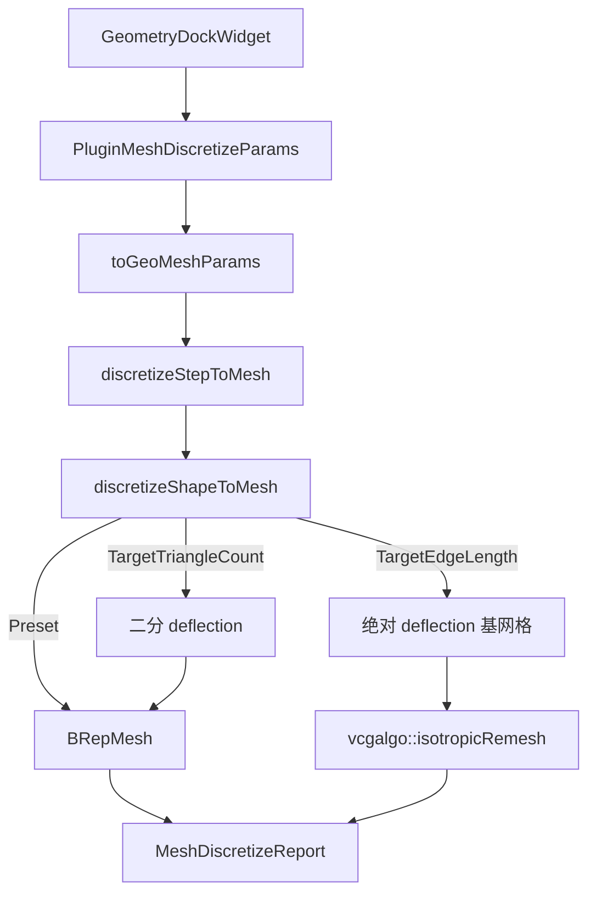

# 离散网格密度控制 - 设计文档

## 1. 架构



## 2. 参数契约

```cpp
enum class MeshDensityControl { QualityPreset, TargetEdgeLength, TargetTriangleCount };

struct MeshDiscretizeParams {
  // ...existing...
  MeshDensityControl densityControl = QualityPreset;
  double targetEdgeLengthMm = 0.0;
  std::size_t targetTriangleCount = 0;
};
```

非 `QualityPreset` 时强制 `quality = Custom`，跳过 `applyQualityPreset` 覆盖。

## 3. 算法要点

### 目标三角面数

- 相对 `linearDeflectionMm` 区间 `[1e-4, 0.2]`，最多 8 次二分
- 误差 ≤15% 退出；否则保留最接近目标的结果

### 目标边长

- 算法侧：`linearDeflectionRelative=false`，`linearDeflectionMm = clamp(target*0.25, 1e-4, …)`
- Data 侧：`isotropicRemesh(soup, targetEdgeLengthMm, …)` 后 `fillMeshReport`

## 4. 异常

- `targetEdgeLengthMm <= 0` 或 `targetTriangleCount == 0`：返回错误
- remesh 失败：透传 `errMsg`，整次离散失败
- UV/Tube/Ribbon 模式：忽略密度二分/边长基网格逻辑（走既有分支）
