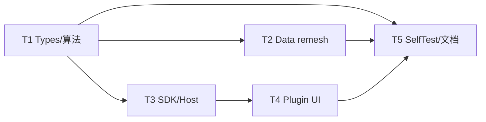

# 离散网格密度控制 - 原子任务

## 依赖图

## T1 算法参数与密度逻辑

- **输入**：CONSENSUS / DESIGN
- **输出**：`Types.h` 新枚举与字段；`MeshDiscretize.cpp` 面数二分与边长基网格
- **验收**：单位盒体面数搜索落入容差；边长模式产出非空 soup

## T2 Data 边长 remesh

- **输入**：T1
- **输出**：`GeometryBackendOps::discretizeStepToMesh` 边长后处理
- **验收**：边长模式后 `avgEdgeLengthMm` 接近目标

## T3 SDK / Host 透传

- **输入**：T1
- **输出**：`PluginGeometryTypes.h`、`DocumentGeometryOps::toGeoMeshParams`
- **验收**：非预设时 `quality=Custom` 且字段映射正确

## T4 Plugin UI

- **输入**：T3
- **输出**：密度模式 combo + 边长/面数 spinbox + `buildDiscretizeParams`
- **验收**：切换显隐正确；离散 status 含 tris / 可选 avgEdge

## T5 测试与文档

- **输入**：T1–T4
- **输出**：SelfTest、DEVELOPER_GUIDE、ACCEPTANCE/FINAL/TODO
- **验收**：`runSelfTest` 通过；验收清单勾选
