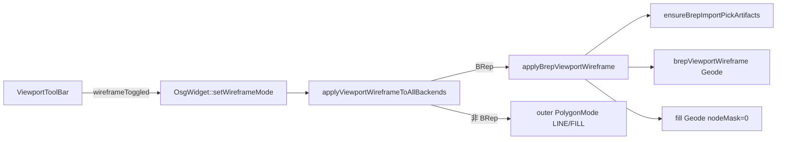
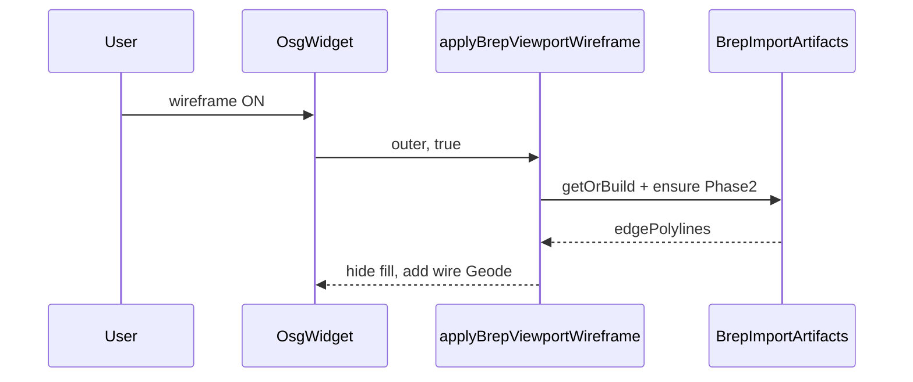

# DESIGN：3D 视口线框显示模式

## 1. 整体架构



## 2. 分层与组件

| 层 | 组件 | 职责 |
|----|------|------|
| UI | `ViewportToolBar` / `DocumentPage` | 不变：信号 → `setWireframeMode` |
| 视口 | `OsgWidget` | 记录 `m_wireframeMode`；分发到各后端分支；upsert 后补应用 |
| Visual | `BrepViewportWireframe`（新） | BRep outer：显隐 fill、懒建拓扑边 Geode |
| 几何 | `BrepImportArtifacts` Phase2 | 已有 `edgePolylines` |

## 3. 场景结构（BRep）

```text
outer (MatrixTransform) + BackendIdUserData(Brep)
└─ inner (PAT)
   └─ Group
      ├─ Geode (fill)                    ← 线框 ON：nodeMask=0
      ├─ Geode "brepWireOverlay"         ← 仅导入 showWireOutline=true 时存在；不删
      └─ Geode "brepViewportWireframe"   ← 视口模式专用；OFF 时移除
```

## 4. 接口契约

```cpp
// BackendVisual：对 BRep outer 应用/撤销视口线框；非 BRep 返回 false
bool applyBrepViewportWireframe(osg::Node* outerBranch, bool enabled);
```

`OsgWidget::setWireframeMode(bool)`：

1. `m_wireframeMode = enabled`
2. 清除 `m_root` 上旧的全局 `PolygonMode` OVERRIDE（兼容旧行为）
3. 遍历 `m_backendObjectRoots` 调用分发逻辑
4. `requestRedraw()`

加载路径：`upsertBackendBranchInScene` / 等价成功路径末尾，若 `m_wireframeMode` 则对该 id 分支再应用一次。

## 5. 数据流



## 6. 异常 / 边界

| 情况 | 策略 |
|------|------|
| Phase2 失败 | fill 仍隐藏则无几何；保持尝试失败不崩溃，可留 fill 可见作兜底（实现：失败则不隐藏 fill） |
| 装配子 alias | 无独立 visual 的 id 不在 roots；只处理有 outer 的父 |
| 已有 `brepWireOverlay` | ON 时复用显示，不重复建 viewport 节点 |

## 7. 模块依赖

`OsgWidget`（Host 编译）→ `BackendVisual` → `GeometryAlgorithm`（已有）
