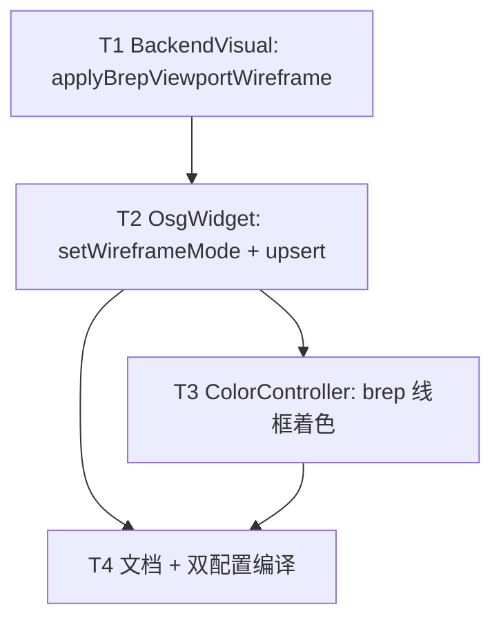

# TASK：3D 视口线框显示模式

## 任务依赖图

## T1 — BackendVisual API

**输入**：现有 `buildBrepEdgeWireGeode` 逻辑、`BackendIdUserData`、artifacts API  
**输出**：`applyBrepViewportWireframe(outer, enabled)` 导出；节点名 `brepViewportWireframe`  
**约束**：失败不抛；Phase2 失败则不隐藏 fill  
**验收**：BRep outer ON→仅边；OFF→填充恢复且移除 viewport 线框节点  
**并行**：无

## T2 — OsgWidget 接线

**输入**：T1 API、`m_backendObjectRoots`、`m_wireframeMode`  
**输出**：重写 `setWireframeMode`；upsert 后尊重模式；清 root 全局 PolygonMode  
**验收**：BRep/Mesh 行为符合 CONSENSUS；新导入 BRep 在线框开时正确  
**依赖**：T1

## T3 — 颜色控制器

**输入**：`OsgWidgetColorController`  
**输出**：`brepWireOverlay` / `brepViewportWireframe` 与 mesh 线框同样压暗  
**依赖**：可与 T2 并行，建议在 T2 后

## T4 — 文档与编译

**输出**：更新 `BackendVisual` / `Widget` DEVELOPER_GUIDE；ACCEPTANCE/FINAL/TODO；Debug+Release 编过相关工程  
**依赖**：T1–T3
