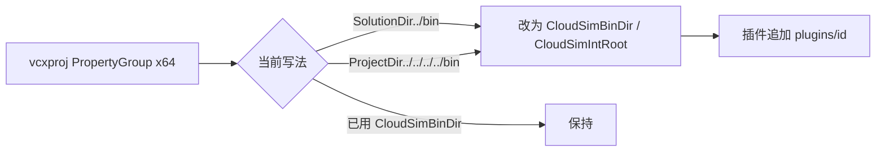

# DESIGN — 统一 VS 输出目录

## 目标路径

```
CGAL5.5.2/
  bin/
    x64d/          ← Debug OutDir（$(CloudSimBinDir)）
      plugins/<id>/
    x64/           ← Release OutDir
      plugins/<id>/
    x64dmiddle/<Project>/
    x64middle/<Project>/
```

变量来源：`CloudSim/Directory.Build.props`（`CloudSimRepoRoot` → 仓库根）。

## 改造规则



| 工程类型 | OutDir | IntDir |
|----------|--------|--------|
| 普通 DLL/LIB/EXE | `$(CloudSimBinDir)` | `$(CloudSimIntRoot)<Name>\` |
| 插件 | `$(CloudSimBinDir)plugins\<id>\` | `$(CloudSimIntRoot)<Name>\` |

x86 PropertyGroup 原样保留。

## 异常

- 单独编 `.vcxproj`：依赖 MSBuild 自动导入 `Directory.Build.props`；若某工程曾手写 Import 兜底且与 props 重复，可删冗余兜底。
- PostBuild 中已用 `$(CloudSimBinDir)` / `$(OutDir)` 的保持不变。
