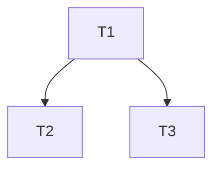

# TASK — 统一 VS 输出目录

## T1 — 批量改写 x64 OutDir/IntDir

- **输入**：全部产品 `.vcxproj`（含 tools）
- **输出**：Debug|x64 / Release|x64 使用 `CloudSimBinDir` / `CloudSimIntRoot`
- **验收**：无工程在 x64 上仍用 `$(SolutionDir)../bin` 或 `$(ProjectDir)...bin\x64` 作为主 OutDir
- **依赖**：无

## T2 — 清理误输出目录

- **输入**：`CloudSim\src\Plugins\bin`
- **输出**：删除该目录树
- **验收**：路径不存在
- **依赖**：T1

## T3 — 抽样编译验证

- **输入**：至少 1 个曾错位工程（如 CloudSimPluginSDK）+ 1 个插件
- **输出**：Debug|x64 与 Release|x64 产物落在仓库根 `bin\x64(d)`
- **验收**：`Plugins\bin` 不再生成；目标路径有新产物
- **依赖**：T1

## 依赖图

