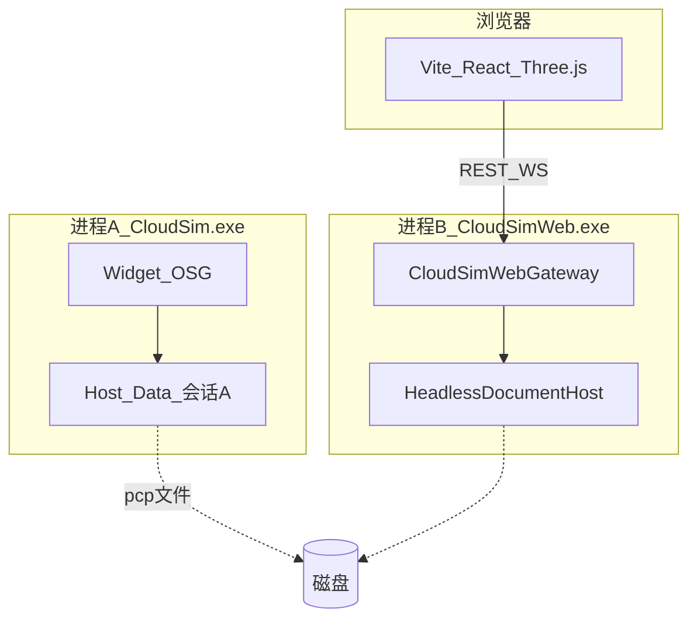

# DESIGN_网页端

## 整体架构



## 分层

| 层 | 组件 | 职责 |
|----|------|------|
| App | `CloudSimWeb.exe` | Qt 事件循环、组合根、启停 Gateway |
| Gateway | `CloudSimWebGateway` | REST/WS、静态托管、文件锁、主线程投递 |
| Host 旁路 | `createHeadless*` | 隐藏 DocumentHost + Null 上下文工厂 |
| Domain | Data/Robot/Geo | 与桌面共享 DLL |
| UI | `cloudsim-web-ui` | 场景/对象树/API 客户端 |

## 接口契约（M0–M1）

| 方法 | 路径 | 说明 |
|------|------|------|
| GET | `/api/health` | `{role,pid,port,ok}` |
| POST | `/api/project/open` | body `{path}` |
| GET | `/api/objects` | 对象快照 + pose |
| GET | `/api/mesh/:id` | `application/octet-stream` float32 soup |
| WS | `/api/events` | EventHub 镜像 JSON |
| POST | `/api/selection` | `{backendId}` |

坐标：mm；位姿 `positionMm` + `eulerDeg`；网格为世界系 triangle soup（与 Data 一致）。Three.js 侧做 Z-up→Y-up 一次转换。

## 异常

- 端口占用：进程退出，日志说明
- 工程版本非 v4：API 400
- 文件锁冲突：API 409
- 未知 id：API 404

## 数据流（开工程）

```
浏览器 POST /api/project/open
  → Gateway 加共享读锁
  → 解压 .pcp（STORE）或直读 project.json
  → loadProjectObjectsFromJson + finalize hierarchy
  → 返回 objectCount
浏览器 GET /api/objects + /api/mesh/:id
  → Three.js 构建场景
```
