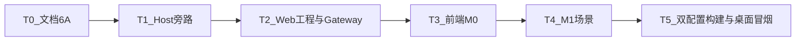

# TASK_网页端

## 依赖图

## T0 文档

- 输入：计划共识  
- 输出：ALIGNMENT/CONSENSUS/DESIGN/TASK  
- 验收：四份文档齐全且与实现一致  

## T1 Host 旁路

- 输入：现有 DocumentHost / ApplicationContext  
- 输出：`cloudsimCreateHeadlessApplicationContext`、`createHeadlessDocumentHost`  
- 约束：桌面路径语义不变  
- 验收：桌面 Debug+Release 可编  

## T2 Web sln / EXE / Gateway

- 输入：T1  
- 输出：`CloudSimWeb.sln`、`CloudSimWeb.exe`、`CloudSimWebGateway`  
- 验收：F5 起服务，`/api/health` OK  

## T3 前端 M0

- 输入：T2  
- 输出：`web/cloudsim-web-ui` → `bin/*/web`  
- 验收：浏览器打开 health 指示  

## T4 M1 场景

- 输入：T3  
- 输出：project/open、objects、mesh、Three.js  
- 验收：同 `.pcp` 与桌面姿态一致  

## T5 构建门禁

- 输入：T1–T4  
- 验收：Web 与桌面 Debug|x64 + Release|x64；桌面未开 Web 端口  

## 后续（不阻塞本期）

- M2 属性/拾取写回；M3 机器人；M4–M6 编程；M7 插件白名单；H2 去 OSG 链  
