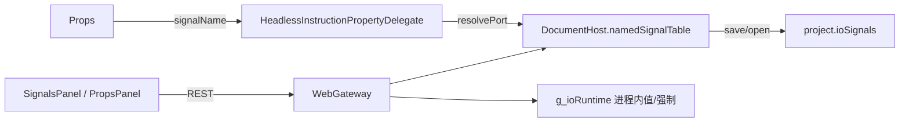

# DESIGN — 网页端 IO 信号对等

## 架构

## 接口

| Method | Path | 说明 |
|--------|------|------|
| GET | `/api/io/signals` | 定义 + value/forced |
| PUT | `/api/io/signals` | 整表替换定义并重置运行时 |
| GET | `/api/io/signals/names?kind=` | 下拉名列表 |
| POST | `/api/io/signals/runtime` | 改值/强制 |
| POST | `/api/io/signals/reset-runtime` | 回默认 |

## 异常

- 无 host / JSON 非法 → 400 + error
- 未知 kind → 400
