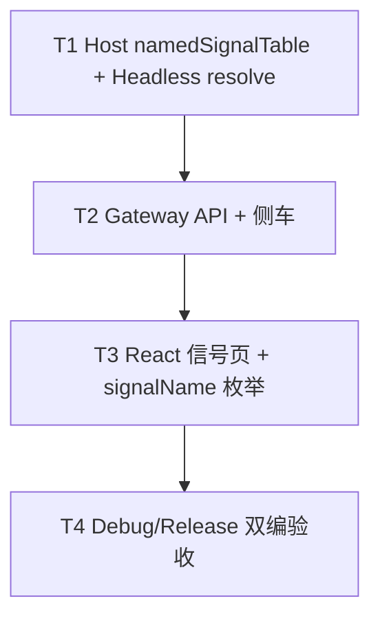

# TASK — 网页端 IO 信号对等

| ID | 内容 | 验收 |
|----|------|------|
| T1 | DocumentHost 表 + patch signalName 解析端口 | 改名后 ioPort 同步 |
| T2 | REST + 开存 ioSignals + 运行时 | curl/页面 CRUD |
| T3 | LeftDock 信号 Tab + 指令下拉 | CONSENSUS UI |
| T4 | 双配置编译 + ACCEPTANCE | 无错误 |
