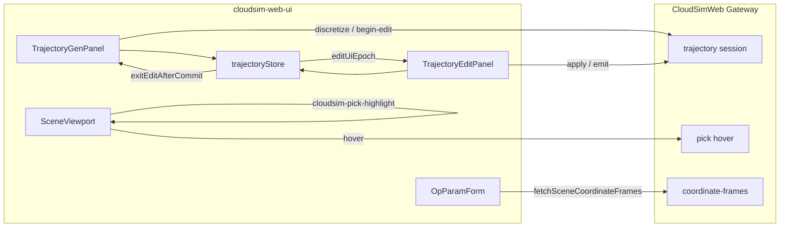
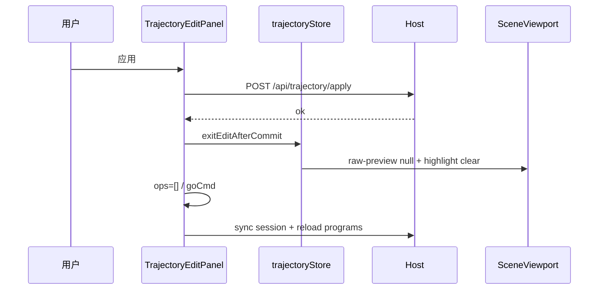

# DESIGN — 网页端 React 轨迹对齐

## 整体架构



## 分层

| 层 | 职责 |
|----|------|
| `state/trajectoryStore` | 会话门闩、特征、PathPlan、提交后复位 |
| `docks/robot/*` | 生成/编辑面板、schema 表单 |
| `scene/*` | 视口、高亮、Raw 预览、帧轴 |
| `api/*` | REST |

## 核心接口契约

### `exitEditAfterCommit`

对齐 fallback `exitTrajEditUiAfterCommit`：

- `features=[]`、`pickMode=null`、`featureEditActive=false`
- `publishRawPreview(null)` + 清拾取高亮
- `editUiEpoch++`
- `syncSession()` 与 Host 对齐

### 外部 TCP 字段

- Schema key：`toWorkpiece.externalTcpBackendId`
- 有后端 id 时隐藏手动六自由度（`isOpFieldVisible`）

### 高亮事件

```ts
// 绘制
{ polys?: number[][][]; soup?: number[] }
// 清除
{ clear: true }
```

## 数据流（应用）



## 异常策略

- apply/emit 失败：不调用 `exitEditAfterCommit`，保留编辑态
- 帧列表 API 空：回落本地/全量 objects；仍空则提示「插入 → 坐标系」
- 过期 hover：`hoverPickSeqRef` 丢弃，防止回写高亮
