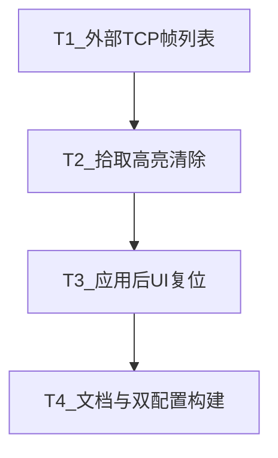

# TASK — 网页端 React 轨迹对齐

## T1 外部 TCP 用插入坐标系

- **输入**：场景已有 `FrameBackendData`；算子 schema 含 `externalTcpBackendId`
- **输出**：`sceneFrames.ts`；`OpParamForm` radio 列表
- **验收**：插入帧后列表可见；选中写入 backendId；手动项隐藏六自由度
- **依赖**：无

## T2 拾取高亮清除

- **输入**：`SceneViewport` overlay 组
- **输出**：提交/取消/离开/未命中时清除；序列号防过期 hover
- **验收**：拾取完成后无残留蓝面/折线
- **依赖**：无（可与 T1 并行）

## T3 应用 / 生成后初始化

- **输入**：fallback `exitTrajEditUiAfterCommit` 语义
- **输出**：`exitEditAfterCommit` + `editUiEpoch`；Edit/Gen 面板复位；`goCmd`
- **验收**：应用后生成页锁定、特征空、预览关、编辑页流水线空
- **依赖**：建议 T2 后（避免预览/高亮残留）

## T4 文档与构建

- **输入**：上述实现
- **输出**：本专题 6A 文档；更新 `web/cloudsim-web-ui/DEVELOPER_GUIDE.md`、`docs/README.md`、模块索引
- **验收**：`build:debug` + `build:release` 通过；文档入口可发现
- **依赖**：T1–T3
