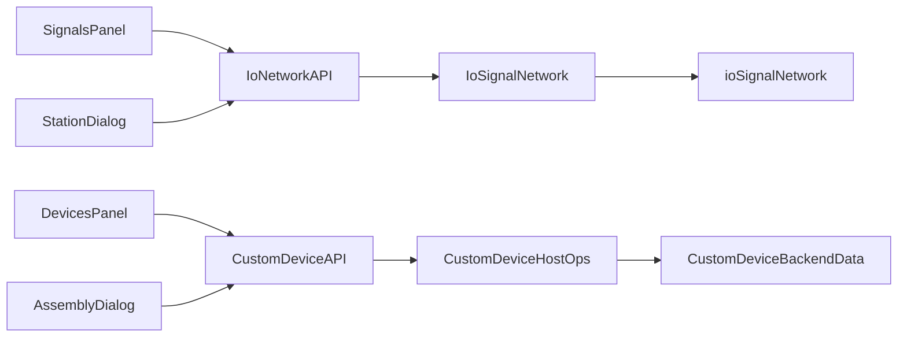

# DESIGN — 网页端信号网络与自定义设备

## API

| 路径 | 作用 |
|------|------|
| GET `/api/io/network` | owners+wires+runtime |
| PUT `/api/io/network/owners/{id}/signals` | 替换 Owner 表 |
| POST/DELETE `/api/io/network/wires` | 增删线 |
| PATCH `.../layout` | canvasXY |
| POST `/api/io/network/runtime` | 写值+propagate |
| GET/PUT `/api/custom-devices/{id}` | 详情/运行面 |
| POST `.../apply-q` `.../goto-pose` | 运动 |
| POST `/api/custom-devices` | 组装 commit |

## 异常

- 接线校验失败返回 400 + error
- 无 Owner 时 SignalsPanel 提示先导入机器人/设备
