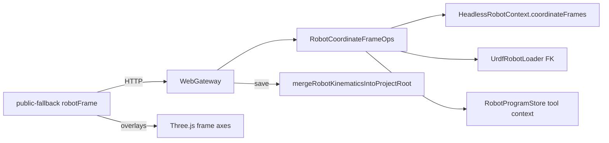

# DESIGN — 网页端坐标系对齐

## 架构

## 分层

| 层 | 职责 |
|----|------|
| Host | 捕获/重置、overlay 世界矩阵、kinematics JSON 写出、instruction tool 同步 |
| Gateway | GUI 线程转发；REST + SSE |
| Frontend | Frames 面板；debounce PUT；关节/IK 后刷 overlays |

## API

| 方法 | 路径 |
|------|------|
| GET | `/api/robot/frames?sceneRootBackendId=` |
| PUT | `/api/robot/frames` |
| POST | `/api/robot/frames/capture-tool` |
| POST | `/api/robot/frames/capture-user` |
| POST | `/api/robot/frames/reset-tool` |
| GET | `/api/robot/frames/overlays?sceneRootBackendId=` |

## Overlay

工具系：`T_world = sceneRootWorld * T_base_tcp`，`T_base_tcp = T_base_flange * T_flange_tool`（per-tool FK）。  
用户系：`T_world = sceneRootWorld * T_base_user`。  
尊重 `showToolFrameInScene` / `showUserFramesInScene` 与单项 `showInScene`。

## 变更分级（PUT）

| 类型 | 行为 |
|------|------|
| DisplayOnly | 只刷 overlays |
| StructuralOnly | 写回 set；不改已绑具体 id 的路点 |
| Active / Geometry | 同步跟随 active 或变更工具 id 的路点 `context.toolFrameMat4`；清示教关节 CSV |
