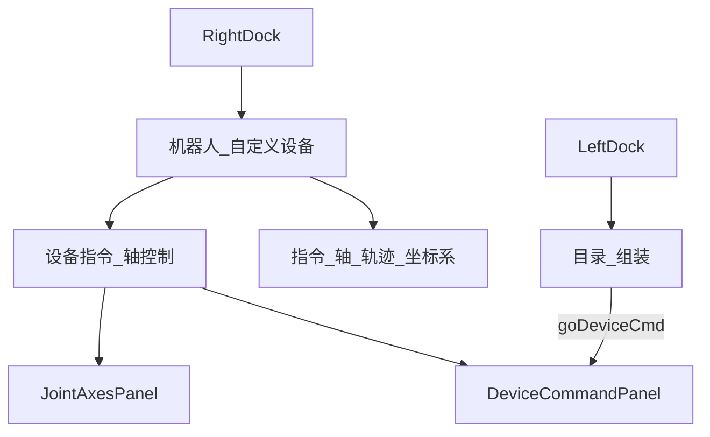

# DESIGN — 网页端设备页桌面同步

| 组件 | 职责 |
|------|------|
| `dockNavStore` | ws / deviceMode / deviceTab / robot tab |
| `deviceRuntimeStore` | selectedCustomDeviceId |
| `DeviceCommandPanel` | 姿态库 + DI→姿态绑定 |
| `JointAxesPanel` | 目标下拉 robot\|device |
| `CustomDevicesSection` | 左栏目录入口 |
