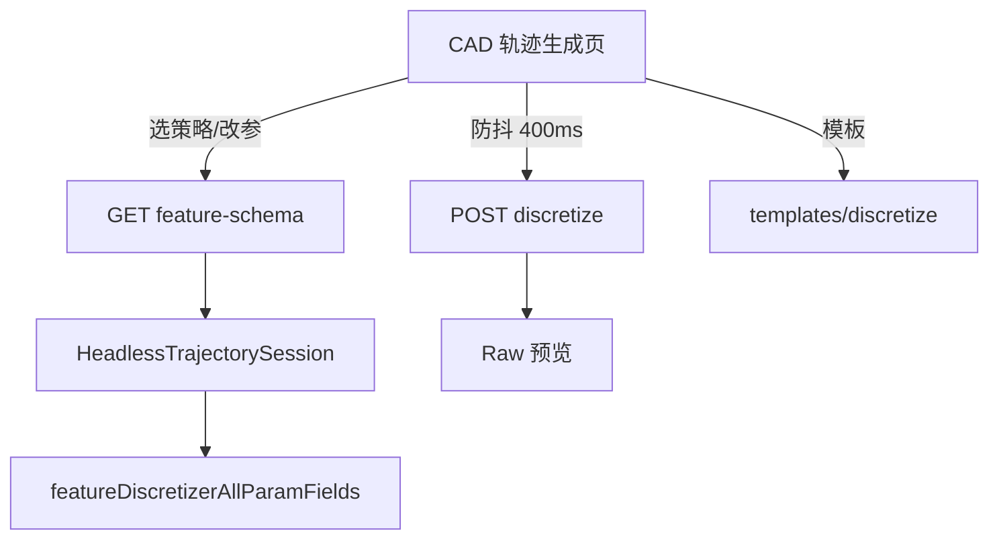

# DESIGN — 网页端轨迹 UI 对齐



## 接口

`GET /api/trajectory/feature-schema?strategyId=FaceParamSurface`

```json
{
  "ok": true,
  "strategyId": "FaceParamSurface",
  "displayNameZh": "参数面扫描",
  "affinity": "Face",
  "fields": [ { "key", "type", "labelZh", "unit", "min", "max", "step", "enumValues", "enumLabelsZh", "defaultDouble", ... } ],
  "defaults": { "stepMm": 10, "colSpacingMm": 1, ... }
}
```

`strategyId` 空时返回 `strategies[]` 目录（id + 中文名 + affinity）。

## 前端状态

- `trajFeatures[].status`: `草稿` | `就绪` | `离散失败`
- `trajFeatures[].params`: 完整策略参数对象
- 选中行 ↔ 策略下拉 ↔ `#featParamForm` 双向绑定
- `scheduleAutoDiscretize()` 防抖 400ms
